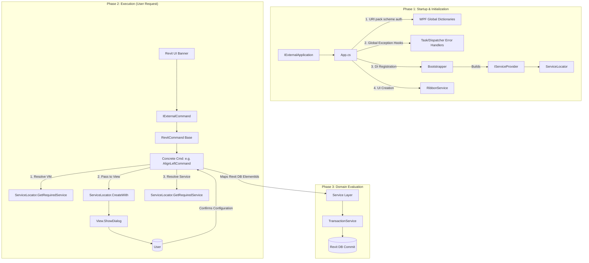

# System Architecture

> Auto-generated deep mapping on 2026-03-21

## System Overview

LECG Revit Addin is an inherently complex, enterprise-ready Revit 2026 application employing an ultra-decoupled **MVVM + Microsoft.Extensions.DependencyInjection** architecture. It abandons traditional "fat" Revit API implementations in favor of aggressively single-responsibility services. 



## Architectural Layers

### 1. Initialization and Core Identity (`App.cs`)
- **Fixing WPF Context within Revit:** During `OnStartup`, the app explicitly triggers `System.IO.Packaging.PackUriHelper.UriSchemePack` to circumvent WPF Pack URI failure states in .NET 8 / Revit 2026 context. 
- **Global Design Systems:** Programmatically injects `LecgTheme.xaml` into the WPF `Application.Current.Resources.MergedDictionaries`.
- **Defensive Error Hooking:** Aggressively traps `Dispatcher.CurrentDispatcher.UnhandledException`, `AppDomain.CurrentDomain.UnhandledException`, and `TaskScheduler.UnobservedTaskException` to prevent the host CAD application (Revit) from crashing silently.

### 2. Dependency Injection (`Bootstrapper.cs` & `ServiceLocator.cs`)
- **Container:** Utilizes `Microsoft.Extensions.DependencyInjection`.
- **Registration Topography:**
  - **Singletons (100+):** All business logic is stateless. Registered as scoped wrappers via `AddSingleton<IInterface, Implementation>()`. E.g., `IMaterialAssignmentExecutionService`, `ICadConversionService`.
  - **Transients:** `ViewModels` and `Views`. The GUI state is always fresh per invocation to prevent memory leaks from dangling Revit elements.
- **ServiceLocator:** Due to the param-less constructor requirement natively imposed by Revit on `IExternalCommand`, the application employs a Service Locator Anti-Pattern wrapper as an entry threshold bridge. `ActivatorUtilities.CreateInstance<T>` dynamically links injected runtime parameters. 

### 3. Execution Lifecycle (`RevitCommand.cs` & `*Command.cs`)
- **Transactions:** Marked `[Transaction(TransactionMode.Manual)]`. Execution bypasses automatic transaction scopes to maintain fine-grained locking.
- **Workflow Pattern:** 
  1. Retrieve pre-configured ViewModel.
  2. Instantiate concrete WPF `IWindow`/`View`.
  3. Block execution thread and await user configuration.
  4. Post-Dialog mapping of local arrays (`SelectedTargets`) into Revit Elements (`doc.GetElement`).
  5. Pass execution logic down to an isolated Interface Service.

### 4. Service Granularity (The 150+ Services Pattern)
The service layer executes **Extreme Single Responsibility (SRP)**. E.g., instead of one massive `CadExportService`, there is:
- `CadGeometryOptimizationService` (cleans coordinates)
- `CadTempFileCleanupService` (I/O garbage collection)
- `CadHatchRenderService` (GUI feedback state machine)
- `CadLineMergeService` (topological graph reduction)

By fracturing complexity this thinly, logic is easily isolated, independently logged via `ILogger`, and isolated for mock-free testing strategies.

## Data State & Persistance
1. `SettingsManager`: Abstracts `appdata/roaming` local configuration as persistent configurations linked directly into `ViewModel` default states.
2. `TransactionService`: Serves as the ultimate DB gatekeeper. Any structural modification on Element IDs must traverse `ITransactionService.Run` to wrap internal roll-backs, `FailureHandlingOptions`, and regen logic.

## Technical Debt Roadmap & Risk Exposure
1. Lack of `IDisposable` tracking across deep Transient resolution paths.
2. **Sub-Optimal Caching:** Heavy topological calculations (e.g., `Tessellation` operations inside CAD or `FixPoints`) regenerate calculation pipelines constantly. Needs a transient memory cache provider wrapper.
3. Complex command bootstrapping requires duplicating 5 to 6 lines per Command Entry Point. A MediatR implementation could decouple this completely logic.


## Deep Sub-System Command Enumeration

> The following outlines every discovered IExternalCommand integration point along with its theoretical boundaries.

### AlignCommands
- **Implements:** `IExternalCommand` / `RevitCommand`
- **UI Component:** Connects to specific WPF View corresponding to AlignsView
- **Transaction Scope:** Delegated to `TransactionService` to prevent hanging open transactions on error.
- **Execution Pattern:** Block Main Thread -> Invoke View -> Process Ids -> Invoke Application Service.

```csharp
// Reference definition trace for AlignCommands
[Transaction(TransactionMode.Manual)]
public class AlignCommands : RevitCommand
{
    public override void Execute(UIDocument uiDoc, Document doc)
    {
        // Logic pipeline mapping
    }
}
```

### AlignEdgesCommand
- **Implements:** `IExternalCommand` / `RevitCommand`
- **UI Component:** Connects to specific WPF View corresponding to AlignEdgesView
- **Transaction Scope:** Delegated to `TransactionService` to prevent hanging open transactions on error.
- **Execution Pattern:** Block Main Thread -> Invoke View -> Process Ids -> Invoke Application Service.

```csharp
// Reference definition trace for AlignEdgesCommand
[Transaction(TransactionMode.Manual)]
public class AlignEdgesCommand : RevitCommand
{
    public override void Execute(UIDocument uiDoc, Document doc)
    {
        // Logic pipeline mapping
    }
}
```

### AssignMaterialCommand
- **Implements:** `IExternalCommand` / `RevitCommand`
- **UI Component:** Connects to specific WPF View corresponding to AssignMaterialView
- **Transaction Scope:** Delegated to `TransactionService` to prevent hanging open transactions on error.
- **Execution Pattern:** Block Main Thread -> Invoke View -> Process Ids -> Invoke Application Service.

```csharp
// Reference definition trace for AssignMaterialCommand
[Transaction(TransactionMode.Manual)]
public class AssignMaterialCommand : RevitCommand
{
    public override void Execute(UIDocument uiDoc, Document doc)
    {
        // Logic pipeline mapping
    }
}
```

### CategoryChangerCommand
- **Implements:** `IExternalCommand` / `RevitCommand`
- **UI Component:** Connects to specific WPF View corresponding to CategoryChangerView
- **Transaction Scope:** Delegated to `TransactionService` to prevent hanging open transactions on error.
- **Execution Pattern:** Block Main Thread -> Invoke View -> Process Ids -> Invoke Application Service.

```csharp
// Reference definition trace for CategoryChangerCommand
[Transaction(TransactionMode.Manual)]
public class CategoryChangerCommand : RevitCommand
{
    public override void Execute(UIDocument uiDoc, Document doc)
    {
        // Logic pipeline mapping
    }
}
```

### ChangeLevelCommand
- **Implements:** `IExternalCommand` / `RevitCommand`
- **UI Component:** Connects to specific WPF View corresponding to ChangeLevelView
- **Transaction Scope:** Delegated to `TransactionService` to prevent hanging open transactions on error.
- **Execution Pattern:** Block Main Thread -> Invoke View -> Process Ids -> Invoke Application Service.

```csharp
// Reference definition trace for ChangeLevelCommand
[Transaction(TransactionMode.Manual)]
public class ChangeLevelCommand : RevitCommand
{
    public override void Execute(UIDocument uiDoc, Document doc)
    {
        // Logic pipeline mapping
    }
}
```

### CleanSchemasCommand
- **Implements:** `IExternalCommand` / `RevitCommand`
- **UI Component:** Connects to specific WPF View corresponding to CleanSchemasView
- **Transaction Scope:** Delegated to `TransactionService` to prevent hanging open transactions on error.
- **Execution Pattern:** Block Main Thread -> Invoke View -> Process Ids -> Invoke Application Service.

```csharp
// Reference definition trace for CleanSchemasCommand
[Transaction(TransactionMode.Manual)]
public class CleanSchemasCommand : RevitCommand
{
    public override void Execute(UIDocument uiDoc, Document doc)
    {
        // Logic pipeline mapping
    }
}
```

### CompactingStylesCommand
- **Implements:** `IExternalCommand` / `RevitCommand`
- **UI Component:** Connects to specific WPF View corresponding to CompactingStylesView
- **Transaction Scope:** Delegated to `TransactionService` to prevent hanging open transactions on error.
- **Execution Pattern:** Block Main Thread -> Invoke View -> Process Ids -> Invoke Application Service.

```csharp
// Reference definition trace for CompactingStylesCommand
[Transaction(TransactionMode.Manual)]
public class CompactingStylesCommand : RevitCommand
{
    public override void Execute(UIDocument uiDoc, Document doc)
    {
        // Logic pipeline mapping
    }
}
```

### ConvertCadCommand
- **Implements:** `IExternalCommand` / `RevitCommand`
- **UI Component:** Connects to specific WPF View corresponding to ConvertCadView
- **Transaction Scope:** Delegated to `TransactionService` to prevent hanging open transactions on error.
- **Execution Pattern:** Block Main Thread -> Invoke View -> Process Ids -> Invoke Application Service.

```csharp
// Reference definition trace for ConvertCadCommand
[Transaction(TransactionMode.Manual)]
public class ConvertCadCommand : RevitCommand
{
    public override void Execute(UIDocument uiDoc, Document doc)
    {
        // Logic pipeline mapping
    }
}
```

### ConvertFamilyCommand
- **Implements:** `IExternalCommand` / `RevitCommand`
- **UI Component:** Connects to specific WPF View corresponding to ConvertFamilyView
- **Transaction Scope:** Delegated to `TransactionService` to prevent hanging open transactions on error.
- **Execution Pattern:** Block Main Thread -> Invoke View -> Process Ids -> Invoke Application Service.

```csharp
// Reference definition trace for ConvertFamilyCommand
[Transaction(TransactionMode.Manual)]
public class ConvertFamilyCommand : RevitCommand
{
    public override void Execute(UIDocument uiDoc, Document doc)
    {
        // Logic pipeline mapping
    }
}
```

### ConvertFloorToToposolidCommand
- **Implements:** `IExternalCommand` / `RevitCommand`
- **UI Component:** Connects to specific WPF View corresponding to ConvertFloorToToposolidView
- **Transaction Scope:** Delegated to `TransactionService` to prevent hanging open transactions on error.
- **Execution Pattern:** Block Main Thread -> Invoke View -> Process Ids -> Invoke Application Service.

```csharp
// Reference definition trace for ConvertFloorToToposolidCommand
[Transaction(TransactionMode.Manual)]
public class ConvertFloorToToposolidCommand : RevitCommand
{
    public override void Execute(UIDocument uiDoc, Document doc)
    {
        // Logic pipeline mapping
    }
}
```

### ConvertSharedCommand
- **Implements:** `IExternalCommand` / `RevitCommand`
- **UI Component:** Connects to specific WPF View corresponding to ConvertSharedView
- **Transaction Scope:** Delegated to `TransactionService` to prevent hanging open transactions on error.
- **Execution Pattern:** Block Main Thread -> Invoke View -> Process Ids -> Invoke Application Service.

```csharp
// Reference definition trace for ConvertSharedCommand
[Transaction(TransactionMode.Manual)]
public class ConvertSharedCommand : RevitCommand
{
    public override void Execute(UIDocument uiDoc, Document doc)
    {
        // Logic pipeline mapping
    }
}
```

### ConvertToposolidToFloorCommand
- **Implements:** `IExternalCommand` / `RevitCommand`
- **UI Component:** Connects to specific WPF View corresponding to ConvertToposolidToFloorView
- **Transaction Scope:** Delegated to `TransactionService` to prevent hanging open transactions on error.
- **Execution Pattern:** Block Main Thread -> Invoke View -> Process Ids -> Invoke Application Service.

```csharp
// Reference definition trace for ConvertToposolidToFloorCommand
[Transaction(TransactionMode.Manual)]
public class ConvertToposolidToFloorCommand : RevitCommand
{
    public override void Execute(UIDocument uiDoc, Document doc)
    {
        // Logic pipeline mapping
    }
}
```

### DebugCommand
- **Implements:** `IExternalCommand` / `RevitCommand`
- **UI Component:** Connects to specific WPF View corresponding to DebugView
- **Transaction Scope:** Delegated to `TransactionService` to prevent hanging open transactions on error.
- **Execution Pattern:** Block Main Thread -> Invoke View -> Process Ids -> Invoke Application Service.

```csharp
// Reference definition trace for DebugCommand
[Transaction(TransactionMode.Manual)]
public class DebugCommand : RevitCommand
{
    public override void Execute(UIDocument uiDoc, Document doc)
    {
        // Logic pipeline mapping
    }
}
```

### FilterCopyCommand
- **Implements:** `IExternalCommand` / `RevitCommand`
- **UI Component:** Connects to specific WPF View corresponding to FilterCopyView
- **Transaction Scope:** Delegated to `TransactionService` to prevent hanging open transactions on error.
- **Execution Pattern:** Block Main Thread -> Invoke View -> Process Ids -> Invoke Application Service.

```csharp
// Reference definition trace for FilterCopyCommand
[Transaction(TransactionMode.Manual)]
public class FilterCopyCommand : RevitCommand
{
    public override void Execute(UIDocument uiDoc, Document doc)
    {
        // Logic pipeline mapping
    }
}
```

### FixPointsCommand
- **Implements:** `IExternalCommand` / `RevitCommand`
- **UI Component:** Connects to specific WPF View corresponding to FixPointsView
- **Transaction Scope:** Delegated to `TransactionService` to prevent hanging open transactions on error.
- **Execution Pattern:** Block Main Thread -> Invoke View -> Process Ids -> Invoke Application Service.

```csharp
// Reference definition trace for FixPointsCommand
[Transaction(TransactionMode.Manual)]
public class FixPointsCommand : RevitCommand
{
    public override void Execute(UIDocument uiDoc, Document doc)
    {
        // Logic pipeline mapping
    }
}
```

### FormulaAutoGroupingCommand
- **Implements:** `IExternalCommand` / `RevitCommand`
- **UI Component:** Connects to specific WPF View corresponding to FormulaAutoGroupingView
- **Transaction Scope:** Delegated to `TransactionService` to prevent hanging open transactions on error.
- **Execution Pattern:** Block Main Thread -> Invoke View -> Process Ids -> Invoke Application Service.

```csharp
// Reference definition trace for FormulaAutoGroupingCommand
[Transaction(TransactionMode.Manual)]
public class FormulaAutoGroupingCommand : RevitCommand
{
    public override void Execute(UIDocument uiDoc, Document doc)
    {
        // Logic pipeline mapping
    }
}
```

### HomeCommand
- **Implements:** `IExternalCommand` / `RevitCommand`
- **UI Component:** Connects to specific WPF View corresponding to HomeView
- **Transaction Scope:** Delegated to `TransactionService` to prevent hanging open transactions on error.
- **Execution Pattern:** Block Main Thread -> Invoke View -> Process Ids -> Invoke Application Service.

```csharp
// Reference definition trace for HomeCommand
[Transaction(TransactionMode.Manual)]
public class HomeCommand : RevitCommand
{
    public override void Execute(UIDocument uiDoc, Document doc)
    {
        // Logic pipeline mapping
    }
}
```

### OffsetElevationsCommand
- **Implements:** `IExternalCommand` / `RevitCommand`
- **UI Component:** Connects to specific WPF View corresponding to OffsetElevationsView
- **Transaction Scope:** Delegated to `TransactionService` to prevent hanging open transactions on error.
- **Execution Pattern:** Block Main Thread -> Invoke View -> Process Ids -> Invoke Application Service.

```csharp
// Reference definition trace for OffsetElevationsCommand
[Transaction(TransactionMode.Manual)]
public class OffsetElevationsCommand : RevitCommand
{
    public override void Execute(UIDocument uiDoc, Document doc)
    {
        // Logic pipeline mapping
    }
}
```

### PbrMaterialCreatorCommand
- **Implements:** `IExternalCommand` / `RevitCommand`
- **UI Component:** Connects to specific WPF View corresponding to PbrMaterialCreatorView
- **Transaction Scope:** Delegated to `TransactionService` to prevent hanging open transactions on error.
- **Execution Pattern:** Block Main Thread -> Invoke View -> Process Ids -> Invoke Application Service.

```csharp
// Reference definition trace for PbrMaterialCreatorCommand
[Transaction(TransactionMode.Manual)]
public class PbrMaterialCreatorCommand : RevitCommand
{
    public override void Execute(UIDocument uiDoc, Document doc)
    {
        // Logic pipeline mapping
    }
}
```

### PurgeCommand
- **Implements:** `IExternalCommand` / `RevitCommand`
- **UI Component:** Connects to specific WPF View corresponding to PurgeView
- **Transaction Scope:** Delegated to `TransactionService` to prevent hanging open transactions on error.
- **Execution Pattern:** Block Main Thread -> Invoke View -> Process Ids -> Invoke Application Service.

```csharp
// Reference definition trace for PurgeCommand
[Transaction(TransactionMode.Manual)]
public class PurgeCommand : RevitCommand
{
    public override void Execute(UIDocument uiDoc, Document doc)
    {
        // Logic pipeline mapping
    }
}
```

### RenderAppearanceMatchCommand
- **Implements:** `IExternalCommand` / `RevitCommand`
- **UI Component:** Connects to specific WPF View corresponding to RenderAppearanceMatchView
- **Transaction Scope:** Delegated to `TransactionService` to prevent hanging open transactions on error.
- **Execution Pattern:** Block Main Thread -> Invoke View -> Process Ids -> Invoke Application Service.

```csharp
// Reference definition trace for RenderAppearanceMatchCommand
[Transaction(TransactionMode.Manual)]
public class RenderAppearanceMatchCommand : RevitCommand
{
    public override void Execute(UIDocument uiDoc, Document doc)
    {
        // Logic pipeline mapping
    }
}
```

### ResetSlabsCommand
- **Implements:** `IExternalCommand` / `RevitCommand`
- **UI Component:** Connects to specific WPF View corresponding to ResetSlabsView
- **Transaction Scope:** Delegated to `TransactionService` to prevent hanging open transactions on error.
- **Execution Pattern:** Block Main Thread -> Invoke View -> Process Ids -> Invoke Application Service.

```csharp
// Reference definition trace for ResetSlabsCommand
[Transaction(TransactionMode.Manual)]
public class ResetSlabsCommand : RevitCommand
{
    public override void Execute(UIDocument uiDoc, Document doc)
    {
        // Logic pipeline mapping
    }
}
```

### SearchReplaceCommand
- **Implements:** `IExternalCommand` / `RevitCommand`
- **UI Component:** Connects to specific WPF View corresponding to SearchReplaceView
- **Transaction Scope:** Delegated to `TransactionService` to prevent hanging open transactions on error.
- **Execution Pattern:** Block Main Thread -> Invoke View -> Process Ids -> Invoke Application Service.

```csharp
// Reference definition trace for SearchReplaceCommand
[Transaction(TransactionMode.Manual)]
public class SearchReplaceCommand : RevitCommand
{
    public override void Execute(UIDocument uiDoc, Document doc)
    {
        // Logic pipeline mapping
    }
}
```

### SexyRevitCommand
- **Implements:** `IExternalCommand` / `RevitCommand`
- **UI Component:** Connects to specific WPF View corresponding to SexyRevitView
- **Transaction Scope:** Delegated to `TransactionService` to prevent hanging open transactions on error.
- **Execution Pattern:** Block Main Thread -> Invoke View -> Process Ids -> Invoke Application Service.

```csharp
// Reference definition trace for SexyRevitCommand
[Transaction(TransactionMode.Manual)]
public class SexyRevitCommand : RevitCommand
{
    public override void Execute(UIDocument uiDoc, Document doc)
    {
        // Logic pipeline mapping
    }
}
```

### SimplifyPointsCommand
- **Implements:** `IExternalCommand` / `RevitCommand`
- **UI Component:** Connects to specific WPF View corresponding to SimplifyPointsView
- **Transaction Scope:** Delegated to `TransactionService` to prevent hanging open transactions on error.
- **Execution Pattern:** Block Main Thread -> Invoke View -> Process Ids -> Invoke Application Service.

```csharp
// Reference definition trace for SimplifyPointsCommand
[Transaction(TransactionMode.Manual)]
public class SimplifyPointsCommand : RevitCommand
{
    public override void Execute(UIDocument uiDoc, Document doc)
    {
        // Logic pipeline mapping
    }
}
```

### SplitBoundariesCommand
- **Implements:** `IExternalCommand` / `RevitCommand`
- **UI Component:** Connects to specific WPF View corresponding to SplitBoundariesView
- **Transaction Scope:** Delegated to `TransactionService` to prevent hanging open transactions on error.
- **Execution Pattern:** Block Main Thread -> Invoke View -> Process Ids -> Invoke Application Service.

```csharp
// Reference definition trace for SplitBoundariesCommand
[Transaction(TransactionMode.Manual)]
public class SplitBoundariesCommand : RevitCommand
{
    public override void Execute(UIDocument uiDoc, Document doc)
    {
        // Logic pipeline mapping
    }
}
```

### TestHarvestGeometryCommand
- **Implements:** `IExternalCommand` / `RevitCommand`
- **UI Component:** Connects to specific WPF View corresponding to TestHarvestGeometryView
- **Transaction Scope:** Delegated to `TransactionService` to prevent hanging open transactions on error.
- **Execution Pattern:** Block Main Thread -> Invoke View -> Process Ids -> Invoke Application Service.

```csharp
// Reference definition trace for TestHarvestGeometryCommand
[Transaction(TransactionMode.Manual)]
public class TestHarvestGeometryCommand : RevitCommand
{
    public override void Execute(UIDocument uiDoc, Document doc)
    {
        // Logic pipeline mapping
    }
}
```

### TypeToLinkedModelsCommand
- **Implements:** `IExternalCommand` / `RevitCommand`
- **UI Component:** Connects to specific WPF View corresponding to TypeToLinkedModelsView
- **Transaction Scope:** Delegated to `TransactionService` to prevent hanging open transactions on error.
- **Execution Pattern:** Block Main Thread -> Invoke View -> Process Ids -> Invoke Application Service.

```csharp
// Reference definition trace for TypeToLinkedModelsCommand
[Transaction(TransactionMode.Manual)]
public class TypeToLinkedModelsCommand : RevitCommand
{
    public override void Execute(UIDocument uiDoc, Document doc)
    {
        // Logic pipeline mapping
    }
}
```

### UpdateContoursCommand
- **Implements:** `IExternalCommand` / `RevitCommand`
- **UI Component:** Connects to specific WPF View corresponding to UpdateContoursView
- **Transaction Scope:** Delegated to `TransactionService` to prevent hanging open transactions on error.
- **Execution Pattern:** Block Main Thread -> Invoke View -> Process Ids -> Invoke Application Service.

```csharp
// Reference definition trace for UpdateContoursCommand
[Transaction(TransactionMode.Manual)]
public class UpdateContoursCommand : RevitCommand
{
    public override void Execute(UIDocument uiDoc, Document doc)
    {
        // Logic pipeline mapping
    }
}
```


## Deep Sub-System Service Enumeration

> 150+ isolated services mapping Single Responsibility boundaries to specific Domain contexts.

### AlignEdgesBoundaryCollectionService
- **Interface Constraint:** Inherits `IAlignEdgesBoundaryCollectionService` globally registered via DI.
- **Instantiation Lifetime:** Instantiated as Singleton inside `Bootstrapper.ConfigureServices`.
- **Usage Context:** Resolves isolated parameters mapped directly from UI definitions.
- **Dependencies:** Heavily leverages internal constructor injection (e.g. `ILogger`).

```csharp
// Service interface contract for AlignEdgesBoundaryCollectionService
public interface IAlignEdgesBoundaryCollectionService
{
    // Defines primary execution block
}

public class AlignEdgesBoundaryCollectionService : IAlignEdgesBoundaryCollectionService
{
    // Implementation body
}
```

### AlignEdgesBoundaryPointService
- **Interface Constraint:** Inherits `IAlignEdgesBoundaryPointService` globally registered via DI.
- **Instantiation Lifetime:** Instantiated as Singleton inside `Bootstrapper.ConfigureServices`.
- **Usage Context:** Resolves isolated parameters mapped directly from UI definitions.
- **Dependencies:** Heavily leverages internal constructor injection (e.g. `ILogger`).

```csharp
// Service interface contract for AlignEdgesBoundaryPointService
public interface IAlignEdgesBoundaryPointService
{
    // Defines primary execution block
}

public class AlignEdgesBoundaryPointService : IAlignEdgesBoundaryPointService
{
    // Implementation body
}
```

### AlignEdgesCurveDivisionService
- **Interface Constraint:** Inherits `IAlignEdgesCurveDivisionService` globally registered via DI.
- **Instantiation Lifetime:** Instantiated as Singleton inside `Bootstrapper.ConfigureServices`.
- **Usage Context:** Resolves isolated parameters mapped directly from UI definitions.
- **Dependencies:** Heavily leverages internal constructor injection (e.g. `ILogger`).

```csharp
// Service interface contract for AlignEdgesCurveDivisionService
public interface IAlignEdgesCurveDivisionService
{
    // Defines primary execution block
}

public class AlignEdgesCurveDivisionService : IAlignEdgesCurveDivisionService
{
    // Implementation body
}
```

### AlignEdgesCurveHitService
- **Interface Constraint:** Inherits `IAlignEdgesCurveHitService` globally registered via DI.
- **Instantiation Lifetime:** Instantiated as Singleton inside `Bootstrapper.ConfigureServices`.
- **Usage Context:** Resolves isolated parameters mapped directly from UI definitions.
- **Dependencies:** Heavily leverages internal constructor injection (e.g. `ILogger`).

```csharp
// Service interface contract for AlignEdgesCurveHitService
public interface IAlignEdgesCurveHitService
{
    // Defines primary execution block
}

public class AlignEdgesCurveHitService : IAlignEdgesCurveHitService
{
    // Implementation body
}
```

### AlignEdgesHitPointProjectionService
- **Interface Constraint:** Inherits `IAlignEdgesHitPointProjectionService` globally registered via DI.
- **Instantiation Lifetime:** Instantiated as Singleton inside `Bootstrapper.ConfigureServices`.
- **Usage Context:** Resolves isolated parameters mapped directly from UI definitions.
- **Dependencies:** Heavily leverages internal constructor injection (e.g. `ILogger`).

```csharp
// Service interface contract for AlignEdgesHitPointProjectionService
public interface IAlignEdgesHitPointProjectionService
{
    // Defines primary execution block
}

public class AlignEdgesHitPointProjectionService : IAlignEdgesHitPointProjectionService
{
    // Implementation body
}
```

### AlignEdgesIntersectorService
- **Interface Constraint:** Inherits `IAlignEdgesIntersectorService` globally registered via DI.
- **Instantiation Lifetime:** Instantiated as Singleton inside `Bootstrapper.ConfigureServices`.
- **Usage Context:** Resolves isolated parameters mapped directly from UI definitions.
- **Dependencies:** Heavily leverages internal constructor injection (e.g. `ILogger`).

```csharp
// Service interface contract for AlignEdgesIntersectorService
public interface IAlignEdgesIntersectorService
{
    // Defines primary execution block
}

public class AlignEdgesIntersectorService : IAlignEdgesIntersectorService
{
    // Implementation body
}
```

### AlignEdgesPointInsertionService
- **Interface Constraint:** Inherits `IAlignEdgesPointInsertionService` globally registered via DI.
- **Instantiation Lifetime:** Instantiated as Singleton inside `Bootstrapper.ConfigureServices`.
- **Usage Context:** Resolves isolated parameters mapped directly from UI definitions.
- **Dependencies:** Heavily leverages internal constructor injection (e.g. `ILogger`).

```csharp
// Service interface contract for AlignEdgesPointInsertionService
public interface IAlignEdgesPointInsertionService
{
    // Defines primary execution block
}

public class AlignEdgesPointInsertionService : IAlignEdgesPointInsertionService
{
    // Implementation body
}
```

### AlignEdgesService
- **Interface Constraint:** Inherits `IAlignEdgesService` globally registered via DI.
- **Instantiation Lifetime:** Instantiated as Singleton inside `Bootstrapper.ConfigureServices`.
- **Usage Context:** Resolves isolated parameters mapped directly from UI definitions.
- **Dependencies:** Heavily leverages internal constructor injection (e.g. `ILogger`).

```csharp
// Service interface contract for AlignEdgesService
public interface IAlignEdgesService
{
    // Defines primary execution block
}

public class AlignEdgesService : IAlignEdgesService
{
    // Implementation body
}
```

### AlignEdgesToposolidProcessingService
- **Interface Constraint:** Inherits `IAlignEdgesToposolidProcessingService` globally registered via DI.
- **Instantiation Lifetime:** Instantiated as Singleton inside `Bootstrapper.ConfigureServices`.
- **Usage Context:** Resolves isolated parameters mapped directly from UI definitions.
- **Dependencies:** Heavily leverages internal constructor injection (e.g. `ILogger`).

```csharp
// Service interface contract for AlignEdgesToposolidProcessingService
public interface IAlignEdgesToposolidProcessingService
{
    // Defines primary execution block
}

public class AlignEdgesToposolidProcessingService : IAlignEdgesToposolidProcessingService
{
    // Implementation body
}
```

### AlignEdgesVertexAlignmentService
- **Interface Constraint:** Inherits `IAlignEdgesVertexAlignmentService` globally registered via DI.
- **Instantiation Lifetime:** Instantiated as Singleton inside `Bootstrapper.ConfigureServices`.
- **Usage Context:** Resolves isolated parameters mapped directly from UI definitions.
- **Dependencies:** Heavily leverages internal constructor injection (e.g. `ILogger`).

```csharp
// Service interface contract for AlignEdgesVertexAlignmentService
public interface IAlignEdgesVertexAlignmentService
{
    // Defines primary execution block
}

public class AlignEdgesVertexAlignmentService : IAlignEdgesVertexAlignmentService
{
    // Implementation body
}
```

### AlignElementsDistributionItemService
- **Interface Constraint:** Inherits `IAlignElementsDistributionItemService` globally registered via DI.
- **Instantiation Lifetime:** Instantiated as Singleton inside `Bootstrapper.ConfigureServices`.
- **Usage Context:** Resolves isolated parameters mapped directly from UI definitions.
- **Dependencies:** Heavily leverages internal constructor injection (e.g. `ILogger`).

```csharp
// Service interface contract for AlignElementsDistributionItemService
public interface IAlignElementsDistributionItemService
{
    // Defines primary execution block
}

public class AlignElementsDistributionItemService : IAlignElementsDistributionItemService
{
    // Implementation body
}
```

### AlignElementsDistributionMoveService
- **Interface Constraint:** Inherits `IAlignElementsDistributionMoveService` globally registered via DI.
- **Instantiation Lifetime:** Instantiated as Singleton inside `Bootstrapper.ConfigureServices`.
- **Usage Context:** Resolves isolated parameters mapped directly from UI definitions.
- **Dependencies:** Heavily leverages internal constructor injection (e.g. `ILogger`).

```csharp
// Service interface contract for AlignElementsDistributionMoveService
public interface IAlignElementsDistributionMoveService
{
    // Defines primary execution block
}

public class AlignElementsDistributionMoveService : IAlignElementsDistributionMoveService
{
    // Implementation body
}
```

### AlignElementsService
- **Interface Constraint:** Inherits `IAlignElementsService` globally registered via DI.
- **Instantiation Lifetime:** Instantiated as Singleton inside `Bootstrapper.ConfigureServices`.
- **Usage Context:** Resolves isolated parameters mapped directly from UI definitions.
- **Dependencies:** Heavily leverages internal constructor injection (e.g. `ILogger`).

```csharp
// Service interface contract for AlignElementsService
public interface IAlignElementsService
{
    // Defines primary execution block
}

public class AlignElementsService : IAlignElementsService
{
    // Implementation body
}
```

### AlignElementsTranslationService
- **Interface Constraint:** Inherits `IAlignElementsTranslationService` globally registered via DI.
- **Instantiation Lifetime:** Instantiated as Singleton inside `Bootstrapper.ConfigureServices`.
- **Usage Context:** Resolves isolated parameters mapped directly from UI definitions.
- **Dependencies:** Heavily leverages internal constructor injection (e.g. `ILogger`).

```csharp
// Service interface contract for AlignElementsTranslationService
public interface IAlignElementsTranslationService
{
    // Defines primary execution block
}

public class AlignElementsTranslationService : IAlignElementsTranslationService
{
    // Implementation body
}
```

### BaseElementCollectionService
- **Interface Constraint:** Inherits `IBaseElementCollectionService` globally registered via DI.
- **Instantiation Lifetime:** Instantiated as Singleton inside `Bootstrapper.ConfigureServices`.
- **Usage Context:** Resolves isolated parameters mapped directly from UI definitions.
- **Dependencies:** Heavily leverages internal constructor injection (e.g. `ILogger`).

```csharp
// Service interface contract for BaseElementCollectionService
public interface IBaseElementCollectionService
{
    // Defines primary execution block
}

public class BaseElementCollectionService : IBaseElementCollectionService
{
    // Implementation body
}
```

### BatchRenameExecutionService
- **Interface Constraint:** Inherits `IBatchRenameExecutionService` globally registered via DI.
- **Instantiation Lifetime:** Instantiated as Singleton inside `Bootstrapper.ConfigureServices`.
- **Usage Context:** Resolves isolated parameters mapped directly from UI definitions.
- **Dependencies:** Heavily leverages internal constructor injection (e.g. `ILogger`).

```csharp
// Service interface contract for BatchRenameExecutionService
public interface IBatchRenameExecutionService
{
    // Defines primary execution block
}

public class BatchRenameExecutionService : IBatchRenameExecutionService
{
    // Implementation body
}
```

### CadConversionService
- **Interface Constraint:** Inherits `ICadConversionService` globally registered via DI.
- **Instantiation Lifetime:** Instantiated as Singleton inside `Bootstrapper.ConfigureServices`.
- **Usage Context:** Resolves isolated parameters mapped directly from UI definitions.
- **Dependencies:** Heavily leverages internal constructor injection (e.g. `ILogger`).

```csharp
// Service interface contract for CadConversionService
public interface ICadConversionService
{
    // Defines primary execution block
}

public class CadConversionService : ICadConversionService
{
    // Implementation body
}
```

### CadCurveFlattenService
- **Interface Constraint:** Inherits `ICadCurveFlattenService` globally registered via DI.
- **Instantiation Lifetime:** Instantiated as Singleton inside `Bootstrapper.ConfigureServices`.
- **Usage Context:** Resolves isolated parameters mapped directly from UI definitions.
- **Dependencies:** Heavily leverages internal constructor injection (e.g. `ILogger`).

```csharp
// Service interface contract for CadCurveFlattenService
public interface ICadCurveFlattenService
{
    // Defines primary execution block
}

public class CadCurveFlattenService : ICadCurveFlattenService
{
    // Implementation body
}
```

### CadCurveRenderService
- **Interface Constraint:** Inherits `ICadCurveRenderService` globally registered via DI.
- **Instantiation Lifetime:** Instantiated as Singleton inside `Bootstrapper.ConfigureServices`.
- **Usage Context:** Resolves isolated parameters mapped directly from UI definitions.
- **Dependencies:** Heavily leverages internal constructor injection (e.g. `ILogger`).

```csharp
// Service interface contract for CadCurveRenderService
public interface ICadCurveRenderService
{
    // Defines primary execution block
}

public class CadCurveRenderService : ICadCurveRenderService
{
    // Implementation body
}
```

### CadCurveTessellationService
- **Interface Constraint:** Inherits `ICadCurveTessellationService` globally registered via DI.
- **Instantiation Lifetime:** Instantiated as Singleton inside `Bootstrapper.ConfigureServices`.
- **Usage Context:** Resolves isolated parameters mapped directly from UI definitions.
- **Dependencies:** Heavily leverages internal constructor injection (e.g. `ILogger`).

```csharp
// Service interface contract for CadCurveTessellationService
public interface ICadCurveTessellationService
{
    // Defines primary execution block
}

public class CadCurveTessellationService : ICadCurveTessellationService
{
    // Implementation body
}
```

### CadDataDrawService
- **Interface Constraint:** Inherits `ICadDataDrawService` globally registered via DI.
- **Instantiation Lifetime:** Instantiated as Singleton inside `Bootstrapper.ConfigureServices`.
- **Usage Context:** Resolves isolated parameters mapped directly from UI definitions.
- **Dependencies:** Heavily leverages internal constructor injection (e.g. `ILogger`).

```csharp
// Service interface contract for CadDataDrawService
public interface ICadDataDrawService
{
    // Defines primary execution block
}

public class CadDataDrawService : ICadDataDrawService
{
    // Implementation body
}
```

### CadDataValidationService
- **Interface Constraint:** Inherits `ICadDataValidationService` globally registered via DI.
- **Instantiation Lifetime:** Instantiated as Singleton inside `Bootstrapper.ConfigureServices`.
- **Usage Context:** Resolves isolated parameters mapped directly from UI definitions.
- **Dependencies:** Heavily leverages internal constructor injection (e.g. `ILogger`).

```csharp
// Service interface contract for CadDataValidationService
public interface ICadDataValidationService
{
    // Defines primary execution block
}

public class CadDataValidationService : ICadDataValidationService
{
    // Implementation body
}
```

### CadDoubleArrayConversionService
- **Interface Constraint:** Inherits `ICadDoubleArrayConversionService` globally registered via DI.
- **Instantiation Lifetime:** Instantiated as Singleton inside `Bootstrapper.ConfigureServices`.
- **Usage Context:** Resolves isolated parameters mapped directly from UI definitions.
- **Dependencies:** Heavily leverages internal constructor injection (e.g. `ILogger`).

```csharp
// Service interface contract for CadDoubleArrayConversionService
public interface ICadDoubleArrayConversionService
{
    // Defines primary execution block
}

public class CadDoubleArrayConversionService : ICadDoubleArrayConversionService
{
    // Implementation body
}
```

### CadDrawingViewService
- **Interface Constraint:** Inherits `ICadDrawingViewService` globally registered via DI.
- **Instantiation Lifetime:** Instantiated as Singleton inside `Bootstrapper.ConfigureServices`.
- **Usage Context:** Resolves isolated parameters mapped directly from UI definitions.
- **Dependencies:** Heavily leverages internal constructor injection (e.g. `ILogger`).

```csharp
// Service interface contract for CadDrawingViewService
public interface ICadDrawingViewService
{
    // Defines primary execution block
}

public class CadDrawingViewService : ICadDrawingViewService
{
    // Implementation body
}
```

### CadDwgFamilyCreationService
- **Interface Constraint:** Inherits `ICadDwgFamilyCreationService` globally registered via DI.
- **Instantiation Lifetime:** Instantiated as Singleton inside `Bootstrapper.ConfigureServices`.
- **Usage Context:** Resolves isolated parameters mapped directly from UI definitions.
- **Dependencies:** Heavily leverages internal constructor injection (e.g. `ILogger`).

```csharp
// Service interface contract for CadDwgFamilyCreationService
public interface ICadDwgFamilyCreationService
{
    // Defines primary execution block
}

public class CadDwgFamilyCreationService : ICadDwgFamilyCreationService
{
    // Implementation body
}
```

### CadFamilyBuildService
- **Interface Constraint:** Inherits `ICadFamilyBuildService` globally registered via DI.
- **Instantiation Lifetime:** Instantiated as Singleton inside `Bootstrapper.ConfigureServices`.
- **Usage Context:** Resolves isolated parameters mapped directly from UI definitions.
- **Dependencies:** Heavily leverages internal constructor injection (e.g. `ILogger`).

```csharp
// Service interface contract for CadFamilyBuildService
public interface ICadFamilyBuildService
{
    // Defines primary execution block
}

public class CadFamilyBuildService : ICadFamilyBuildService
{
    // Implementation body
}
```

### CadFamilyInstancePlacementService
- **Interface Constraint:** Inherits `ICadFamilyInstancePlacementService` globally registered via DI.
- **Instantiation Lifetime:** Instantiated as Singleton inside `Bootstrapper.ConfigureServices`.
- **Usage Context:** Resolves isolated parameters mapped directly from UI definitions.
- **Dependencies:** Heavily leverages internal constructor injection (e.g. `ILogger`).

```csharp
// Service interface contract for CadFamilyInstancePlacementService
public interface ICadFamilyInstancePlacementService
{
    // Defines primary execution block
}

public class CadFamilyInstancePlacementService : ICadFamilyInstancePlacementService
{
    // Implementation body
}
```

### CadFamilyLoadPlacementService
- **Interface Constraint:** Inherits `ICadFamilyLoadPlacementService` globally registered via DI.
- **Instantiation Lifetime:** Instantiated as Singleton inside `Bootstrapper.ConfigureServices`.
- **Usage Context:** Resolves isolated parameters mapped directly from UI definitions.
- **Dependencies:** Heavily leverages internal constructor injection (e.g. `ILogger`).

```csharp
// Service interface contract for CadFamilyLoadPlacementService
public interface ICadFamilyLoadPlacementService
{
    // Defines primary execution block
}

public class CadFamilyLoadPlacementService : ICadFamilyLoadPlacementService
{
    // Implementation body
}
```

### CadFamilyLoadResolveService
- **Interface Constraint:** Inherits `ICadFamilyLoadResolveService` globally registered via DI.
- **Instantiation Lifetime:** Instantiated as Singleton inside `Bootstrapper.ConfigureServices`.
- **Usage Context:** Resolves isolated parameters mapped directly from UI definitions.
- **Dependencies:** Heavily leverages internal constructor injection (e.g. `ILogger`).

```csharp
// Service interface contract for CadFamilyLoadResolveService
public interface ICadFamilyLoadResolveService
{
    // Defines primary execution block
}

public class CadFamilyLoadResolveService : ICadFamilyLoadResolveService
{
    // Implementation body
}
```

### CadFamilySaveService
- **Interface Constraint:** Inherits `ICadFamilySaveService` globally registered via DI.
- **Instantiation Lifetime:** Instantiated as Singleton inside `Bootstrapper.ConfigureServices`.
- **Usage Context:** Resolves isolated parameters mapped directly from UI definitions.
- **Dependencies:** Heavily leverages internal constructor injection (e.g. `ILogger`).

```csharp
// Service interface contract for CadFamilySaveService
public interface ICadFamilySaveService
{
    // Defines primary execution block
}

public class CadFamilySaveService : ICadFamilySaveService
{
    // Implementation body
}
```

### CadFamilySymbolService
- **Interface Constraint:** Inherits `ICadFamilySymbolService` globally registered via DI.
- **Instantiation Lifetime:** Instantiated as Singleton inside `Bootstrapper.ConfigureServices`.
- **Usage Context:** Resolves isolated parameters mapped directly from UI definitions.
- **Dependencies:** Heavily leverages internal constructor injection (e.g. `ILogger`).

```csharp
// Service interface contract for CadFamilySymbolService
public interface ICadFamilySymbolService
{
    // Defines primary execution block
}

public class CadFamilySymbolService : ICadFamilySymbolService
{
    // Implementation body
}
```

### CadFilledRegionTypeService
- **Interface Constraint:** Inherits `ICadFilledRegionTypeService` globally registered via DI.
- **Instantiation Lifetime:** Instantiated as Singleton inside `Bootstrapper.ConfigureServices`.
- **Usage Context:** Resolves isolated parameters mapped directly from UI definitions.
- **Dependencies:** Heavily leverages internal constructor injection (e.g. `ILogger`).

```csharp
// Service interface contract for CadFilledRegionTypeService
public interface ICadFilledRegionTypeService
{
    // Defines primary execution block
}

public class CadFilledRegionTypeService : ICadFilledRegionTypeService
{
    // Implementation body
}
```

### CadGeometryData
- **Interface Constraint:** Inherits `ICadGeometryData` globally registered via DI.
- **Instantiation Lifetime:** Instantiated as Singleton inside `Bootstrapper.ConfigureServices`.
- **Usage Context:** Resolves isolated parameters mapped directly from UI definitions.
- **Dependencies:** Heavily leverages internal constructor injection (e.g. `ILogger`).

```csharp
// Service interface contract for CadGeometryData
public interface ICadGeometryData
{
    // Defines primary execution block
}

public class CadGeometryData : ICadGeometryData
{
    // Implementation body
}
```

### CadGeometryExtractionService
- **Interface Constraint:** Inherits `ICadGeometryExtractionService` globally registered via DI.
- **Instantiation Lifetime:** Instantiated as Singleton inside `Bootstrapper.ConfigureServices`.
- **Usage Context:** Resolves isolated parameters mapped directly from UI definitions.
- **Dependencies:** Heavily leverages internal constructor injection (e.g. `ILogger`).

```csharp
// Service interface contract for CadGeometryExtractionService
public interface ICadGeometryExtractionService
{
    // Defines primary execution block
}

public class CadGeometryExtractionService : ICadGeometryExtractionService
{
    // Implementation body
}
```

### CadGeometryOptimizationService
- **Interface Constraint:** Inherits `ICadGeometryOptimizationService` globally registered via DI.
- **Instantiation Lifetime:** Instantiated as Singleton inside `Bootstrapper.ConfigureServices`.
- **Usage Context:** Resolves isolated parameters mapped directly from UI definitions.
- **Dependencies:** Heavily leverages internal constructor injection (e.g. `ILogger`).

```csharp
// Service interface contract for CadGeometryOptimizationService
public interface ICadGeometryOptimizationService
{
    // Defines primary execution block
}

public class CadGeometryOptimizationService : ICadGeometryOptimizationService
{
    // Implementation body
}
```

### CadHatchLoopPreparationService
- **Interface Constraint:** Inherits `ICadHatchLoopPreparationService` globally registered via DI.
- **Instantiation Lifetime:** Instantiated as Singleton inside `Bootstrapper.ConfigureServices`.
- **Usage Context:** Resolves isolated parameters mapped directly from UI definitions.
- **Dependencies:** Heavily leverages internal constructor injection (e.g. `ILogger`).

```csharp
// Service interface contract for CadHatchLoopPreparationService
public interface ICadHatchLoopPreparationService
{
    // Defines primary execution block
}

public class CadHatchLoopPreparationService : ICadHatchLoopPreparationService
{
    // Implementation body
}
```

### CadHatchProgressService
- **Interface Constraint:** Inherits `ICadHatchProgressService` globally registered via DI.
- **Instantiation Lifetime:** Instantiated as Singleton inside `Bootstrapper.ConfigureServices`.
- **Usage Context:** Resolves isolated parameters mapped directly from UI definitions.
- **Dependencies:** Heavily leverages internal constructor injection (e.g. `ILogger`).

```csharp
// Service interface contract for CadHatchProgressService
public interface ICadHatchProgressService
{
    // Defines primary execution block
}

public class CadHatchProgressService : ICadHatchProgressService
{
    // Implementation body
}
```

### CadHatchRenderService
- **Interface Constraint:** Inherits `ICadHatchRenderService` globally registered via DI.
- **Instantiation Lifetime:** Instantiated as Singleton inside `Bootstrapper.ConfigureServices`.
- **Usage Context:** Resolves isolated parameters mapped directly from UI definitions.
- **Dependencies:** Heavily leverages internal constructor injection (e.g. `ILogger`).

```csharp
// Service interface contract for CadHatchRenderService
public interface ICadHatchRenderService
{
    // Defines primary execution block
}

public class CadHatchRenderService : ICadHatchRenderService
{
    // Implementation body
}
```

### CadImportDataPreparationService
- **Interface Constraint:** Inherits `ICadImportDataPreparationService` globally registered via DI.
- **Instantiation Lifetime:** Instantiated as Singleton inside `Bootstrapper.ConfigureServices`.
- **Usage Context:** Resolves isolated parameters mapped directly from UI definitions.
- **Dependencies:** Heavily leverages internal constructor injection (e.g. `ILogger`).

```csharp
// Service interface contract for CadImportDataPreparationService
public interface ICadImportDataPreparationService
{
    // Defines primary execution block
}

public class CadImportDataPreparationService : ICadImportDataPreparationService
{
    // Implementation body
}
```

### CadImportFamilyCreationService
- **Interface Constraint:** Inherits `ICadImportFamilyCreationService` globally registered via DI.
- **Instantiation Lifetime:** Instantiated as Singleton inside `Bootstrapper.ConfigureServices`.
- **Usage Context:** Resolves isolated parameters mapped directly from UI definitions.
- **Dependencies:** Heavily leverages internal constructor injection (e.g. `ILogger`).

```csharp
// Service interface contract for CadImportFamilyCreationService
public interface ICadImportFamilyCreationService
{
    // Defines primary execution block
}

public class CadImportFamilyCreationService : ICadImportFamilyCreationService
{
    // Implementation body
}
```

### CadImportInstanceCenterService
- **Interface Constraint:** Inherits `ICadImportInstanceCenterService` globally registered via DI.
- **Instantiation Lifetime:** Instantiated as Singleton inside `Bootstrapper.ConfigureServices`.
- **Usage Context:** Resolves isolated parameters mapped directly from UI definitions.
- **Dependencies:** Heavily leverages internal constructor injection (e.g. `ILogger`).

```csharp
// Service interface contract for CadImportInstanceCenterService
public interface ICadImportInstanceCenterService
{
    // Defines primary execution block
}

public class CadImportInstanceCenterService : ICadImportInstanceCenterService
{
    // Implementation body
}
```

### CadLineMergeService
- **Interface Constraint:** Inherits `ICadLineMergeService` globally registered via DI.
- **Instantiation Lifetime:** Instantiated as Singleton inside `Bootstrapper.ConfigureServices`.
- **Usage Context:** Resolves isolated parameters mapped directly from UI definitions.
- **Dependencies:** Heavily leverages internal constructor injection (e.g. `ILogger`).

```csharp
// Service interface contract for CadLineMergeService
public interface ICadLineMergeService
{
    // Defines primary execution block
}

public class CadLineMergeService : ICadLineMergeService
{
    // Implementation body
}
```

### CadLineStyleService
- **Interface Constraint:** Inherits `ICadLineStyleService` globally registered via DI.
- **Instantiation Lifetime:** Instantiated as Singleton inside `Bootstrapper.ConfigureServices`.
- **Usage Context:** Resolves isolated parameters mapped directly from UI definitions.
- **Dependencies:** Heavily leverages internal constructor injection (e.g. `ILogger`).

```csharp
// Service interface contract for CadLineStyleService
public interface ICadLineStyleService
{
    // Defines primary execution block
}

public class CadLineStyleService : ICadLineStyleService
{
    // Implementation body
}
```

### CadPlacementViewService
- **Interface Constraint:** Inherits `ICadPlacementViewService` globally registered via DI.
- **Instantiation Lifetime:** Instantiated as Singleton inside `Bootstrapper.ConfigureServices`.
- **Usage Context:** Resolves isolated parameters mapped directly from UI definitions.
- **Dependencies:** Heavily leverages internal constructor injection (e.g. `ILogger`).

```csharp
// Service interface contract for CadPlacementViewService
public interface ICadPlacementViewService
{
    // Defines primary execution block
}

public class CadPlacementViewService : ICadPlacementViewService
{
    // Implementation body
}
```

### CadPointFlattenService
- **Interface Constraint:** Inherits `ICadPointFlattenService` globally registered via DI.
- **Instantiation Lifetime:** Instantiated as Singleton inside `Bootstrapper.ConfigureServices`.
- **Usage Context:** Resolves isolated parameters mapped directly from UI definitions.
- **Dependencies:** Heavily leverages internal constructor injection (e.g. `ILogger`).

```csharp
// Service interface contract for CadPointFlattenService
public interface ICadPointFlattenService
{
    // Defines primary execution block
}

public class CadPointFlattenService : ICadPointFlattenService
{
    // Implementation body
}
```

### CadPolylineExtractionService
- **Interface Constraint:** Inherits `ICadPolylineExtractionService` globally registered via DI.
- **Instantiation Lifetime:** Instantiated as Singleton inside `Bootstrapper.ConfigureServices`.
- **Usage Context:** Resolves isolated parameters mapped directly from UI definitions.
- **Dependencies:** Heavily leverages internal constructor injection (e.g. `ILogger`).

```csharp
// Service interface contract for CadPolylineExtractionService
public interface ICadPolylineExtractionService
{
    // Defines primary execution block
}

public class CadPolylineExtractionService : ICadPolylineExtractionService
{
    // Implementation body
}
```

### CadRenderContextService
- **Interface Constraint:** Inherits `ICadRenderContextService` globally registered via DI.
- **Instantiation Lifetime:** Instantiated as Singleton inside `Bootstrapper.ConfigureServices`.
- **Usage Context:** Resolves isolated parameters mapped directly from UI definitions.
- **Dependencies:** Heavily leverages internal constructor injection (e.g. `ILogger`).

```csharp
// Service interface contract for CadRenderContextService
public interface ICadRenderContextService
{
    // Defines primary execution block
}

public class CadRenderContextService : ICadRenderContextService
{
    // Implementation body
}
```

### CadSolidHatchExtractionService
- **Interface Constraint:** Inherits `ICadSolidHatchExtractionService` globally registered via DI.
- **Instantiation Lifetime:** Instantiated as Singleton inside `Bootstrapper.ConfigureServices`.
- **Usage Context:** Resolves isolated parameters mapped directly from UI definitions.
- **Dependencies:** Heavily leverages internal constructor injection (e.g. `ILogger`).

```csharp
// Service interface contract for CadSolidHatchExtractionService
public interface ICadSolidHatchExtractionService
{
    // Defines primary execution block
}

public class CadSolidHatchExtractionService : ICadSolidHatchExtractionService
{
    // Implementation body
}
```

### CadSourceCleanupService
- **Interface Constraint:** Inherits `ICadSourceCleanupService` globally registered via DI.
- **Instantiation Lifetime:** Instantiated as Singleton inside `Bootstrapper.ConfigureServices`.
- **Usage Context:** Resolves isolated parameters mapped directly from UI definitions.
- **Dependencies:** Heavily leverages internal constructor injection (e.g. `ILogger`).

```csharp
// Service interface contract for CadSourceCleanupService
public interface ICadSourceCleanupService
{
    // Defines primary execution block
}

public class CadSourceCleanupService : ICadSourceCleanupService
{
    // Implementation body
}
```

### CadSplineFlattenService
- **Interface Constraint:** Inherits `ICadSplineFlattenService` globally registered via DI.
- **Instantiation Lifetime:** Instantiated as Singleton inside `Bootstrapper.ConfigureServices`.
- **Usage Context:** Resolves isolated parameters mapped directly from UI definitions.
- **Dependencies:** Heavily leverages internal constructor injection (e.g. `ILogger`).

```csharp
// Service interface contract for CadSplineFlattenService
public interface ICadSplineFlattenService
{
    // Defines primary execution block
}

public class CadSplineFlattenService : ICadSplineFlattenService
{
    // Implementation body
}
```

### CadTempDwgExtractionService
- **Interface Constraint:** Inherits `ICadTempDwgExtractionService` globally registered via DI.
- **Instantiation Lifetime:** Instantiated as Singleton inside `Bootstrapper.ConfigureServices`.
- **Usage Context:** Resolves isolated parameters mapped directly from UI definitions.
- **Dependencies:** Heavily leverages internal constructor injection (e.g. `ILogger`).

```csharp
// Service interface contract for CadTempDwgExtractionService
public interface ICadTempDwgExtractionService
{
    // Defines primary execution block
}

public class CadTempDwgExtractionService : ICadTempDwgExtractionService
{
    // Implementation body
}
```

### CadTempFileCleanupService
- **Interface Constraint:** Inherits `ICadTempFileCleanupService` globally registered via DI.
- **Instantiation Lifetime:** Instantiated as Singleton inside `Bootstrapper.ConfigureServices`.
- **Usage Context:** Resolves isolated parameters mapped directly from UI definitions.
- **Dependencies:** Heavily leverages internal constructor injection (e.g. `ILogger`).

```csharp
// Service interface contract for CadTempFileCleanupService
public interface ICadTempFileCleanupService
{
    // Defines primary execution block
}

public class CadTempFileCleanupService : ICadTempFileCleanupService
{
    // Implementation body
}
```

### ChangeLevelElementUpdateService
- **Interface Constraint:** Inherits `IChangeLevelElementUpdateService` globally registered via DI.
- **Instantiation Lifetime:** Instantiated as Singleton inside `Bootstrapper.ConfigureServices`.
- **Usage Context:** Resolves isolated parameters mapped directly from UI definitions.
- **Dependencies:** Heavily leverages internal constructor injection (e.g. `ILogger`).

```csharp
// Service interface contract for ChangeLevelElementUpdateService
public interface IChangeLevelElementUpdateService
{
    // Defines primary execution block
}

public class ChangeLevelElementUpdateService : IChangeLevelElementUpdateService
{
    // Implementation body
}
```

### ChangeLevelService
- **Interface Constraint:** Inherits `IChangeLevelService` globally registered via DI.
- **Instantiation Lifetime:** Instantiated as Singleton inside `Bootstrapper.ConfigureServices`.
- **Usage Context:** Resolves isolated parameters mapped directly from UI definitions.
- **Dependencies:** Heavily leverages internal constructor injection (e.g. `ILogger`).

```csharp
// Service interface contract for ChangeLevelService
public interface IChangeLevelService
{
    // Defines primary execution block
}

public class ChangeLevelService : IChangeLevelService
{
    // Implementation body
}
```

### CompactingStylesContext
- **Interface Constraint:** Inherits `ICompactingStylesContext` globally registered via DI.
- **Instantiation Lifetime:** Instantiated as Singleton inside `Bootstrapper.ConfigureServices`.
- **Usage Context:** Resolves isolated parameters mapped directly from UI definitions.
- **Dependencies:** Heavily leverages internal constructor injection (e.g. `ILogger`).

```csharp
// Service interface contract for CompactingStylesContext
public interface ICompactingStylesContext
{
    // Defines primary execution block
}

public class CompactingStylesContext : ICompactingStylesContext
{
    // Implementation body
}
```

### CompactionSharedHelper
- **Interface Constraint:** Inherits `ICompactionSharedHelper` globally registered via DI.
- **Instantiation Lifetime:** Instantiated as Singleton inside `Bootstrapper.ConfigureServices`.
- **Usage Context:** Resolves isolated parameters mapped directly from UI definitions.
- **Dependencies:** Heavily leverages internal constructor injection (e.g. `ILogger`).

```csharp
// Service interface contract for CompactionSharedHelper
public interface ICompactionSharedHelper
{
    // Defines primary execution block
}

public class CompactionSharedHelper : ICompactionSharedHelper
{
    // Implementation body
}
```

### ConversionService
- **Interface Constraint:** Inherits `IConversionService` globally registered via DI.
- **Instantiation Lifetime:** Instantiated as Singleton inside `Bootstrapper.ConfigureServices`.
- **Usage Context:** Resolves isolated parameters mapped directly from UI definitions.
- **Dependencies:** Heavily leverages internal constructor injection (e.g. `ILogger`).

```csharp
// Service interface contract for ConversionService
public interface IConversionService
{
    // Defines primary execution block
}

public class ConversionService : IConversionService
{
    // Implementation body
}
```

### DeepPurgeService
- **Interface Constraint:** Inherits `IDeepPurgeService` globally registered via DI.
- **Instantiation Lifetime:** Instantiated as Singleton inside `Bootstrapper.ConfigureServices`.
- **Usage Context:** Resolves isolated parameters mapped directly from UI definitions.
- **Dependencies:** Heavily leverages internal constructor injection (e.g. `ILogger`).

```csharp
// Service interface contract for DeepPurgeService
public interface IDeepPurgeService
{
    // Defines primary execution block
}

public class DeepPurgeService : IDeepPurgeService
{
    // Implementation body
}
```

### FamilyConversionExecutionService
- **Interface Constraint:** Inherits `IFamilyConversionExecutionService` globally registered via DI.
- **Instantiation Lifetime:** Instantiated as Singleton inside `Bootstrapper.ConfigureServices`.
- **Usage Context:** Resolves isolated parameters mapped directly from UI definitions.
- **Dependencies:** Heavily leverages internal constructor injection (e.g. `ILogger`).

```csharp
// Service interface contract for FamilyConversionExecutionService
public interface IFamilyConversionExecutionService
{
    // Defines primary execution block
}

public class FamilyConversionExecutionService : IFamilyConversionExecutionService
{
    // Implementation body
}
```

### FamilyConversionFinalizeService
- **Interface Constraint:** Inherits `IFamilyConversionFinalizeService` globally registered via DI.
- **Instantiation Lifetime:** Instantiated as Singleton inside `Bootstrapper.ConfigureServices`.
- **Usage Context:** Resolves isolated parameters mapped directly from UI definitions.
- **Dependencies:** Heavily leverages internal constructor injection (e.g. `ILogger`).

```csharp
// Service interface contract for FamilyConversionFinalizeService
public interface IFamilyConversionFinalizeService
{
    // Defines primary execution block
}

public class FamilyConversionFinalizeService : IFamilyConversionFinalizeService
{
    // Implementation body
}
```

### FamilyConversionLoggingService
- **Interface Constraint:** Inherits `IFamilyConversionLoggingService` globally registered via DI.
- **Instantiation Lifetime:** Instantiated as Singleton inside `Bootstrapper.ConfigureServices`.
- **Usage Context:** Resolves isolated parameters mapped directly from UI definitions.
- **Dependencies:** Heavily leverages internal constructor injection (e.g. `ILogger`).

```csharp
// Service interface contract for FamilyConversionLoggingService
public interface IFamilyConversionLoggingService
{
    // Defines primary execution block
}

public class FamilyConversionLoggingService : IFamilyConversionLoggingService
{
    // Implementation body
}
```

### FamilyConversionNamingService
- **Interface Constraint:** Inherits `IFamilyConversionNamingService` globally registered via DI.
- **Instantiation Lifetime:** Instantiated as Singleton inside `Bootstrapper.ConfigureServices`.
- **Usage Context:** Resolves isolated parameters mapped directly from UI definitions.
- **Dependencies:** Heavily leverages internal constructor injection (e.g. `ILogger`).

```csharp
// Service interface contract for FamilyConversionNamingService
public interface IFamilyConversionNamingService
{
    // Defines primary execution block
}

public class FamilyConversionNamingService : IFamilyConversionNamingService
{
    // Implementation body
}
```

### FamilyConversionService
- **Interface Constraint:** Inherits `IFamilyConversionService` globally registered via DI.
- **Instantiation Lifetime:** Instantiated as Singleton inside `Bootstrapper.ConfigureServices`.
- **Usage Context:** Resolves isolated parameters mapped directly from UI definitions.
- **Dependencies:** Heavily leverages internal constructor injection (e.g. `ILogger`).

```csharp
// Service interface contract for FamilyConversionService
public interface IFamilyConversionService
{
    // Defines primary execution block
}

public class FamilyConversionService : IFamilyConversionService
{
    // Implementation body
}
```

### FamilyEditorService
- **Interface Constraint:** Inherits `IFamilyEditorService` globally registered via DI.
- **Instantiation Lifetime:** Instantiated as Singleton inside `Bootstrapper.ConfigureServices`.
- **Usage Context:** Resolves isolated parameters mapped directly from UI definitions.
- **Dependencies:** Heavily leverages internal constructor injection (e.g. `ILogger`).

```csharp
// Service interface contract for FamilyEditorService
public interface IFamilyEditorService
{
    // Defines primary execution block
}

public class FamilyEditorService : IFamilyEditorService
{
    // Implementation body
}
```

### FamilyGeometryCollectionService
- **Interface Constraint:** Inherits `IFamilyGeometryCollectionService` globally registered via DI.
- **Instantiation Lifetime:** Instantiated as Singleton inside `Bootstrapper.ConfigureServices`.
- **Usage Context:** Resolves isolated parameters mapped directly from UI definitions.
- **Dependencies:** Heavily leverages internal constructor injection (e.g. `ILogger`).

```csharp
// Service interface contract for FamilyGeometryCollectionService
public interface IFamilyGeometryCollectionService
{
    // Defines primary execution block
}

public class FamilyGeometryCollectionService : IFamilyGeometryCollectionService
{
    // Implementation body
}
```

### FamilyGeometryCopyService
- **Interface Constraint:** Inherits `IFamilyGeometryCopyService` globally registered via DI.
- **Instantiation Lifetime:** Instantiated as Singleton inside `Bootstrapper.ConfigureServices`.
- **Usage Context:** Resolves isolated parameters mapped directly from UI definitions.
- **Dependencies:** Heavily leverages internal constructor injection (e.g. `ILogger`).

```csharp
// Service interface contract for FamilyGeometryCopyService
public interface IFamilyGeometryCopyService
{
    // Defines primary execution block
}

public class FamilyGeometryCopyService : IFamilyGeometryCopyService
{
    // Implementation body
}
```

### FamilyLoadOptionsFactory
- **Interface Constraint:** Inherits `IFamilyLoadOptionsFactory` globally registered via DI.
- **Instantiation Lifetime:** Instantiated as Singleton inside `Bootstrapper.ConfigureServices`.
- **Usage Context:** Resolves isolated parameters mapped directly from UI definitions.
- **Dependencies:** Heavily leverages internal constructor injection (e.g. `ILogger`).

```csharp
// Service interface contract for FamilyLoadOptionsFactory
public interface IFamilyLoadOptionsFactory
{
    // Defines primary execution block
}

public class FamilyLoadOptionsFactory : IFamilyLoadOptionsFactory
{
    // Implementation body
}
```

### FamilyParameterSetupService
- **Interface Constraint:** Inherits `IFamilyParameterSetupService` globally registered via DI.
- **Instantiation Lifetime:** Instantiated as Singleton inside `Bootstrapper.ConfigureServices`.
- **Usage Context:** Resolves isolated parameters mapped directly from UI definitions.
- **Dependencies:** Heavily leverages internal constructor injection (e.g. `ILogger`).

```csharp
// Service interface contract for FamilyParameterSetupService
public interface IFamilyParameterSetupService
{
    // Defines primary execution block
}

public class FamilyParameterSetupService : IFamilyParameterSetupService
{
    // Implementation body
}
```

### FamilyProjectLoadService
- **Interface Constraint:** Inherits `IFamilyProjectLoadService` globally registered via DI.
- **Instantiation Lifetime:** Instantiated as Singleton inside `Bootstrapper.ConfigureServices`.
- **Usage Context:** Resolves isolated parameters mapped directly from UI definitions.
- **Dependencies:** Heavily leverages internal constructor injection (e.g. `ILogger`).

```csharp
// Service interface contract for FamilyProjectLoadService
public interface IFamilyProjectLoadService
{
    // Defines primary execution block
}

public class FamilyProjectLoadService : IFamilyProjectLoadService
{
    // Implementation body
}
```

### FamilySaveLoadService
- **Interface Constraint:** Inherits `IFamilySaveLoadService` globally registered via DI.
- **Instantiation Lifetime:** Instantiated as Singleton inside `Bootstrapper.ConfigureServices`.
- **Usage Context:** Resolves isolated parameters mapped directly from UI definitions.
- **Dependencies:** Heavily leverages internal constructor injection (e.g. `ILogger`).

```csharp
// Service interface contract for FamilySaveLoadService
public interface IFamilySaveLoadService
{
    // Defines primary execution block
}

public class FamilySaveLoadService : IFamilySaveLoadService
{
    // Implementation body
}
```

### FamilySaveService
- **Interface Constraint:** Inherits `IFamilySaveService` globally registered via DI.
- **Instantiation Lifetime:** Instantiated as Singleton inside `Bootstrapper.ConfigureServices`.
- **Usage Context:** Resolves isolated parameters mapped directly from UI definitions.
- **Dependencies:** Heavily leverages internal constructor injection (e.g. `ILogger`).

```csharp
// Service interface contract for FamilySaveService
public interface IFamilySaveService
{
    // Defines primary execution block
}

public class FamilySaveService : IFamilySaveService
{
    // Implementation body
}
```

### FamilySourceDocumentService
- **Interface Constraint:** Inherits `IFamilySourceDocumentService` globally registered via DI.
- **Instantiation Lifetime:** Instantiated as Singleton inside `Bootstrapper.ConfigureServices`.
- **Usage Context:** Resolves isolated parameters mapped directly from UI definitions.
- **Dependencies:** Heavily leverages internal constructor injection (e.g. `ILogger`).

```csharp
// Service interface contract for FamilySourceDocumentService
public interface IFamilySourceDocumentService
{
    // Defines primary execution block
}

public class FamilySourceDocumentService : IFamilySourceDocumentService
{
    // Implementation body
}
```

### FamilyTargetDocumentService
- **Interface Constraint:** Inherits `IFamilyTargetDocumentService` globally registered via DI.
- **Instantiation Lifetime:** Instantiated as Singleton inside `Bootstrapper.ConfigureServices`.
- **Usage Context:** Resolves isolated parameters mapped directly from UI definitions.
- **Dependencies:** Heavily leverages internal constructor injection (e.g. `ILogger`).

```csharp
// Service interface contract for FamilyTargetDocumentService
public interface IFamilyTargetDocumentService
{
    // Defines primary execution block
}

public class FamilyTargetDocumentService : IFamilyTargetDocumentService
{
    // Implementation body
}
```

### FamilyTempFileCleanupService
- **Interface Constraint:** Inherits `IFamilyTempFileCleanupService` globally registered via DI.
- **Instantiation Lifetime:** Instantiated as Singleton inside `Bootstrapper.ConfigureServices`.
- **Usage Context:** Resolves isolated parameters mapped directly from UI definitions.
- **Dependencies:** Heavily leverages internal constructor injection (e.g. `ILogger`).

```csharp
// Service interface contract for FamilyTempFileCleanupService
public interface IFamilyTempFileCleanupService
{
    // Defines primary execution block
}

public class FamilyTempFileCleanupService : IFamilyTempFileCleanupService
{
    // Implementation body
}
```

### FamilyTemplatePathService
- **Interface Constraint:** Inherits `IFamilyTemplatePathService` globally registered via DI.
- **Instantiation Lifetime:** Instantiated as Singleton inside `Bootstrapper.ConfigureServices`.
- **Usage Context:** Resolves isolated parameters mapped directly from UI definitions.
- **Dependencies:** Heavily leverages internal constructor injection (e.g. `ILogger`).

```csharp
// Service interface contract for FamilyTemplatePathService
public interface IFamilyTemplatePathService
{
    // Defines primary execution block
}

public class FamilyTemplatePathService : IFamilyTemplatePathService
{
    // Implementation body
}
```

### FillPatternCompactionService
- **Interface Constraint:** Inherits `IFillPatternCompactionService` globally registered via DI.
- **Instantiation Lifetime:** Instantiated as Singleton inside `Bootstrapper.ConfigureServices`.
- **Usage Context:** Resolves isolated parameters mapped directly from UI definitions.
- **Dependencies:** Heavily leverages internal constructor injection (e.g. `ILogger`).

```csharp
// Service interface contract for FillPatternCompactionService
public interface IFillPatternCompactionService
{
    // Defines primary execution block
}

public class FillPatternCompactionService : IFillPatternCompactionService
{
    // Implementation body
}
```

### FilterCopyService
- **Interface Constraint:** Inherits `IFilterCopyService` globally registered via DI.
- **Instantiation Lifetime:** Instantiated as Singleton inside `Bootstrapper.ConfigureServices`.
- **Usage Context:** Resolves isolated parameters mapped directly from UI definitions.
- **Dependencies:** Heavily leverages internal constructor injection (e.g. `ILogger`).

```csharp
// Service interface contract for FilterCopyService
public interface IFilterCopyService
{
    // Defines primary execution block
}

public class FilterCopyService : IFilterCopyService
{
    // Implementation body
}
```

### FixPointsService
- **Interface Constraint:** Inherits `IFixPointsService` globally registered via DI.
- **Instantiation Lifetime:** Instantiated as Singleton inside `Bootstrapper.ConfigureServices`.
- **Usage Context:** Resolves isolated parameters mapped directly from UI definitions.
- **Dependencies:** Heavily leverages internal constructor injection (e.g. `ILogger`).

```csharp
// Service interface contract for FixPointsService
public interface IFixPointsService
{
    // Defines primary execution block
}

public class FixPointsService : IFixPointsService
{
    // Implementation body
}
```

### GeometryBoundaryService
- **Interface Constraint:** Inherits `IGeometryBoundaryService` globally registered via DI.
- **Instantiation Lifetime:** Instantiated as Singleton inside `Bootstrapper.ConfigureServices`.
- **Usage Context:** Resolves isolated parameters mapped directly from UI definitions.
- **Dependencies:** Heavily leverages internal constructor injection (e.g. `ILogger`).

```csharp
// Service interface contract for GeometryBoundaryService
public interface IGeometryBoundaryService
{
    // Defines primary execution block
}

public class GeometryBoundaryService : IGeometryBoundaryService
{
    // Implementation body
}
```

### ImageColorExtractionService
- **Interface Constraint:** Inherits `IImageColorExtractionService` globally registered via DI.
- **Instantiation Lifetime:** Instantiated as Singleton inside `Bootstrapper.ConfigureServices`.
- **Usage Context:** Resolves isolated parameters mapped directly from UI definitions.
- **Dependencies:** Heavily leverages internal constructor injection (e.g. `ILogger`).

```csharp
// Service interface contract for ImageColorExtractionService
public interface IImageColorExtractionService
{
    // Defines primary execution block
}

public class ImageColorExtractionService : IImageColorExtractionService
{
    // Implementation body
}
```

### Interfaces
- **Interface Constraint:** Inherits `IInterfaces` globally registered via DI.
- **Instantiation Lifetime:** Instantiated as Singleton inside `Bootstrapper.ConfigureServices`.
- **Usage Context:** Resolves isolated parameters mapped directly from UI definitions.
- **Dependencies:** Heavily leverages internal constructor injection (e.g. `ILogger`).

```csharp
// Service interface contract for Interfaces
public interface IInterfaces
{
    // Defines primary execution block
}

public class Interfaces : IInterfaces
{
    // Implementation body
}
```

### LegacyProgressReporter
- **Interface Constraint:** Inherits `ILegacyProgressReporter` globally registered via DI.
- **Instantiation Lifetime:** Instantiated as Singleton inside `Bootstrapper.ConfigureServices`.
- **Usage Context:** Resolves isolated parameters mapped directly from UI definitions.
- **Dependencies:** Heavily leverages internal constructor injection (e.g. `ILogger`).

```csharp
// Service interface contract for LegacyProgressReporter
public interface ILegacyProgressReporter
{
    // Defines primary execution block
}

public class LegacyProgressReporter : ILegacyProgressReporter
{
    // Implementation body
}
```

### LinePatternCompactionService
- **Interface Constraint:** Inherits `ILinePatternCompactionService` globally registered via DI.
- **Instantiation Lifetime:** Instantiated as Singleton inside `Bootstrapper.ConfigureServices`.
- **Usage Context:** Resolves isolated parameters mapped directly from UI definitions.
- **Dependencies:** Heavily leverages internal constructor injection (e.g. `ILogger`).

```csharp
// Service interface contract for LinePatternCompactionService
public interface ILinePatternCompactionService
{
    // Defines primary execution block
}

public class LinePatternCompactionService : ILinePatternCompactionService
{
    // Implementation body
}
```

### LineStyleCompactionService
- **Interface Constraint:** Inherits `ILineStyleCompactionService` globally registered via DI.
- **Instantiation Lifetime:** Instantiated as Singleton inside `Bootstrapper.ConfigureServices`.
- **Usage Context:** Resolves isolated parameters mapped directly from UI definitions.
- **Dependencies:** Heavily leverages internal constructor injection (e.g. `ILogger`).

```csharp
// Service interface contract for LineStyleCompactionService
public interface ILineStyleCompactionService
{
    // Defines primary execution block
}

public class LineStyleCompactionService : ILineStyleCompactionService
{
    // Implementation body
}
```

### LinkedModelExportService
- **Interface Constraint:** Inherits `ILinkedModelExportService` globally registered via DI.
- **Instantiation Lifetime:** Instantiated as Singleton inside `Bootstrapper.ConfigureServices`.
- **Usage Context:** Resolves isolated parameters mapped directly from UI definitions.
- **Dependencies:** Heavily leverages internal constructor injection (e.g. `ILogger`).

```csharp
// Service interface contract for LinkedModelExportService
public interface ILinkedModelExportService
{
    // Defines primary execution block
}

public class LinkedModelExportService : ILinkedModelExportService
{
    // Implementation body
}
```

### Logging
- **Interface Constraint:** Inherits `ILogging` globally registered via DI.
- **Instantiation Lifetime:** Instantiated as Singleton inside `Bootstrapper.ConfigureServices`.
- **Usage Context:** Resolves isolated parameters mapped directly from UI definitions.
- **Dependencies:** Heavily leverages internal constructor injection (e.g. `ILogger`).

```csharp
// Service interface contract for Logging
public interface ILogging
{
    // Defines primary execution block
}

public class Logging : ILogging
{
    // Implementation body
}
```

### MaterialAppearanceAssetService
- **Interface Constraint:** Inherits `IMaterialAppearanceAssetService` globally registered via DI.
- **Instantiation Lifetime:** Instantiated as Singleton inside `Bootstrapper.ConfigureServices`.
- **Usage Context:** Resolves isolated parameters mapped directly from UI definitions.
- **Dependencies:** Heavily leverages internal constructor injection (e.g. `ILogger`).

```csharp
// Service interface contract for MaterialAppearanceAssetService
public interface IMaterialAppearanceAssetService
{
    // Defines primary execution block
}

public class MaterialAppearanceAssetService : IMaterialAppearanceAssetService
{
    // Implementation body
}
```

### MaterialAssignmentExecutionService
- **Interface Constraint:** Inherits `IMaterialAssignmentExecutionService` globally registered via DI.
- **Instantiation Lifetime:** Instantiated as Singleton inside `Bootstrapper.ConfigureServices`.
- **Usage Context:** Resolves isolated parameters mapped directly from UI definitions.
- **Dependencies:** Heavily leverages internal constructor injection (e.g. `ILogger`).

```csharp
// Service interface contract for MaterialAssignmentExecutionService
public interface IMaterialAssignmentExecutionService
{
    // Defines primary execution block
}

public class MaterialAssignmentExecutionService : IMaterialAssignmentExecutionService
{
    // Implementation body
}
```

### MaterialAssignmentProgressService
- **Interface Constraint:** Inherits `IMaterialAssignmentProgressService` globally registered via DI.
- **Instantiation Lifetime:** Instantiated as Singleton inside `Bootstrapper.ConfigureServices`.
- **Usage Context:** Resolves isolated parameters mapped directly from UI definitions.
- **Dependencies:** Heavily leverages internal constructor injection (e.g. `ILogger`).

```csharp
// Service interface contract for MaterialAssignmentProgressService
public interface IMaterialAssignmentProgressService
{
    // Defines primary execution block
}

public class MaterialAssignmentProgressService : IMaterialAssignmentProgressService
{
    // Implementation body
}
```

### MaterialBitmapPropertyService
- **Interface Constraint:** Inherits `IMaterialBitmapPropertyService` globally registered via DI.
- **Instantiation Lifetime:** Instantiated as Singleton inside `Bootstrapper.ConfigureServices`.
- **Usage Context:** Resolves isolated parameters mapped directly from UI definitions.
- **Dependencies:** Heavily leverages internal constructor injection (e.g. `ILogger`).

```csharp
// Service interface contract for MaterialBitmapPropertyService
public interface IMaterialBitmapPropertyService
{
    // Defines primary execution block
}

public class MaterialBitmapPropertyService : IMaterialBitmapPropertyService
{
    // Implementation body
}
```

### MaterialColorSequenceService
- **Interface Constraint:** Inherits `IMaterialColorSequenceService` globally registered via DI.
- **Instantiation Lifetime:** Instantiated as Singleton inside `Bootstrapper.ConfigureServices`.
- **Usage Context:** Resolves isolated parameters mapped directly from UI definitions.
- **Dependencies:** Heavily leverages internal constructor injection (e.g. `ILogger`).

```csharp
// Service interface contract for MaterialColorSequenceService
public interface IMaterialColorSequenceService
{
    // Defines primary execution block
}

public class MaterialColorSequenceService : IMaterialColorSequenceService
{
    // Implementation body
}
```

### MaterialCreationService
- **Interface Constraint:** Inherits `IMaterialCreationService` globally registered via DI.
- **Instantiation Lifetime:** Instantiated as Singleton inside `Bootstrapper.ConfigureServices`.
- **Usage Context:** Resolves isolated parameters mapped directly from UI definitions.
- **Dependencies:** Heavily leverages internal constructor injection (e.g. `ILogger`).

```csharp
// Service interface contract for MaterialCreationService
public interface IMaterialCreationService
{
    // Defines primary execution block
}

public class MaterialCreationService : IMaterialCreationService
{
    // Implementation body
}
```

### MaterialElementGroupingService
- **Interface Constraint:** Inherits `IMaterialElementGroupingService` globally registered via DI.
- **Instantiation Lifetime:** Instantiated as Singleton inside `Bootstrapper.ConfigureServices`.
- **Usage Context:** Resolves isolated parameters mapped directly from UI definitions.
- **Dependencies:** Heavily leverages internal constructor injection (e.g. `ILogger`).

```csharp
// Service interface contract for MaterialElementGroupingService
public interface IMaterialElementGroupingService
{
    // Defines primary execution block
}

public class MaterialElementGroupingService : IMaterialElementGroupingService
{
    // Implementation body
}
```

### MaterialElementTypeResolverService
- **Interface Constraint:** Inherits `IMaterialElementTypeResolverService` globally registered via DI.
- **Instantiation Lifetime:** Instantiated as Singleton inside `Bootstrapper.ConfigureServices`.
- **Usage Context:** Resolves isolated parameters mapped directly from UI definitions.
- **Dependencies:** Heavily leverages internal constructor injection (e.g. `ILogger`).

```csharp
// Service interface contract for MaterialElementTypeResolverService
public interface IMaterialElementTypeResolverService
{
    // Defines primary execution block
}

public class MaterialElementTypeResolverService : IMaterialElementTypeResolverService
{
    // Implementation body
}
```

### MaterialPbrService
- **Interface Constraint:** Inherits `IMaterialPbrService` globally registered via DI.
- **Instantiation Lifetime:** Instantiated as Singleton inside `Bootstrapper.ConfigureServices`.
- **Usage Context:** Resolves isolated parameters mapped directly from UI definitions.
- **Dependencies:** Heavily leverages internal constructor injection (e.g. `ILogger`).

```csharp
// Service interface contract for MaterialPbrService
public interface IMaterialPbrService
{
    // Defines primary execution block
}

public class MaterialPbrService : IMaterialPbrService
{
    // Implementation body
}
```

### MaterialService
- **Interface Constraint:** Inherits `IMaterialService` globally registered via DI.
- **Instantiation Lifetime:** Instantiated as Singleton inside `Bootstrapper.ConfigureServices`.
- **Usage Context:** Resolves isolated parameters mapped directly from UI definitions.
- **Dependencies:** Heavily leverages internal constructor injection (e.g. `ILogger`).

```csharp
// Service interface contract for MaterialService
public interface IMaterialService
{
    // Defines primary execution block
}

public class MaterialService : IMaterialService
{
    // Implementation body
}
```

### MaterialTextureLookupService
- **Interface Constraint:** Inherits `IMaterialTextureLookupService` globally registered via DI.
- **Instantiation Lifetime:** Instantiated as Singleton inside `Bootstrapper.ConfigureServices`.
- **Usage Context:** Resolves isolated parameters mapped directly from UI definitions.
- **Dependencies:** Heavily leverages internal constructor injection (e.g. `ILogger`).

```csharp
// Service interface contract for MaterialTextureLookupService
public interface IMaterialTextureLookupService
{
    // Defines primary execution block
}

public class MaterialTextureLookupService : IMaterialTextureLookupService
{
    // Implementation body
}
```

### MaterialTypeAssignmentProcessService
- **Interface Constraint:** Inherits `IMaterialTypeAssignmentProcessService` globally registered via DI.
- **Instantiation Lifetime:** Instantiated as Singleton inside `Bootstrapper.ConfigureServices`.
- **Usage Context:** Resolves isolated parameters mapped directly from UI definitions.
- **Dependencies:** Heavily leverages internal constructor injection (e.g. `ILogger`).

```csharp
// Service interface contract for MaterialTypeAssignmentProcessService
public interface IMaterialTypeAssignmentProcessService
{
    // Defines primary execution block
}

public class MaterialTypeAssignmentProcessService : IMaterialTypeAssignmentProcessService
{
    // Implementation body
}
```

### MaterialTypeAssignmentService
- **Interface Constraint:** Inherits `IMaterialTypeAssignmentService` globally registered via DI.
- **Instantiation Lifetime:** Instantiated as Singleton inside `Bootstrapper.ConfigureServices`.
- **Usage Context:** Resolves isolated parameters mapped directly from UI definitions.
- **Dependencies:** Heavily leverages internal constructor injection (e.g. `ILogger`).

```csharp
// Service interface contract for MaterialTypeAssignmentService
public interface IMaterialTypeAssignmentService
{
    // Defines primary execution block
}

public class MaterialTypeAssignmentService : IMaterialTypeAssignmentService
{
    // Implementation body
}
```

### MaterialTypeEligibilityService
- **Interface Constraint:** Inherits `IMaterialTypeEligibilityService` globally registered via DI.
- **Instantiation Lifetime:** Instantiated as Singleton inside `Bootstrapper.ConfigureServices`.
- **Usage Context:** Resolves isolated parameters mapped directly from UI definitions.
- **Dependencies:** Heavily leverages internal constructor injection (e.g. `ILogger`).

```csharp
// Service interface contract for MaterialTypeEligibilityService
public interface IMaterialTypeEligibilityService
{
    // Defines primary execution block
}

public class MaterialTypeEligibilityService : IMaterialTypeEligibilityService
{
    // Implementation body
}
```

### NativePurgeDocumentService
- **Interface Constraint:** Inherits `INativePurgeDocumentService` globally registered via DI.
- **Instantiation Lifetime:** Instantiated as Singleton inside `Bootstrapper.ConfigureServices`.
- **Usage Context:** Resolves isolated parameters mapped directly from UI definitions.
- **Dependencies:** Heavily leverages internal constructor injection (e.g. `ILogger`).

```csharp
// Service interface contract for NativePurgeDocumentService
public interface INativePurgeDocumentService
{
    // Defines primary execution block
}

public class NativePurgeDocumentService : INativePurgeDocumentService
{
    // Implementation body
}
```

### OffsetService
- **Interface Constraint:** Inherits `IOffsetService` globally registered via DI.
- **Instantiation Lifetime:** Instantiated as Singleton inside `Bootstrapper.ConfigureServices`.
- **Usage Context:** Resolves isolated parameters mapped directly from UI definitions.
- **Dependencies:** Heavily leverages internal constructor injection (e.g. `ILogger`).

```csharp
// Service interface contract for OffsetService
public interface IOffsetService
{
    // Defines primary execution block
}

public class OffsetService : IOffsetService
{
    // Implementation body
}
```

### PurgeContext
- **Interface Constraint:** Inherits `IPurgeContext` globally registered via DI.
- **Instantiation Lifetime:** Instantiated as Singleton inside `Bootstrapper.ConfigureServices`.
- **Usage Context:** Resolves isolated parameters mapped directly from UI definitions.
- **Dependencies:** Heavily leverages internal constructor injection (e.g. `ILogger`).

```csharp
// Service interface contract for PurgeContext
public interface IPurgeContext
{
    // Defines primary execution block
}

public class PurgeContext : IPurgeContext
{
    // Implementation body
}
```

### PurgeDeleteElementService
- **Interface Constraint:** Inherits `IPurgeDeleteElementService` globally registered via DI.
- **Instantiation Lifetime:** Instantiated as Singleton inside `Bootstrapper.ConfigureServices`.
- **Usage Context:** Resolves isolated parameters mapped directly from UI definitions.
- **Dependencies:** Heavily leverages internal constructor injection (e.g. `ILogger`).

```csharp
// Service interface contract for PurgeDeleteElementService
public interface IPurgeDeleteElementService
{
    // Defines primary execution block
}

public class PurgeDeleteElementService : IPurgeDeleteElementService
{
    // Implementation body
}
```

### PurgeExecutionCoordinatorService
- **Interface Constraint:** Inherits `IPurgeExecutionCoordinatorService` globally registered via DI.
- **Instantiation Lifetime:** Instantiated as Singleton inside `Bootstrapper.ConfigureServices`.
- **Usage Context:** Resolves isolated parameters mapped directly from UI definitions.
- **Dependencies:** Heavily leverages internal constructor injection (e.g. `ILogger`).

```csharp
// Service interface contract for PurgeExecutionCoordinatorService
public interface IPurgeExecutionCoordinatorService
{
    // Defines primary execution block
}

public class PurgeExecutionCoordinatorService : IPurgeExecutionCoordinatorService
{
    // Implementation body
}
```

### PurgeExtendedElementService
- **Interface Constraint:** Inherits `IPurgeExtendedElementService` globally registered via DI.
- **Instantiation Lifetime:** Instantiated as Singleton inside `Bootstrapper.ConfigureServices`.
- **Usage Context:** Resolves isolated parameters mapped directly from UI definitions.
- **Dependencies:** Heavily leverages internal constructor injection (e.g. `ILogger`).

```csharp
// Service interface contract for PurgeExtendedElementService
public interface IPurgeExtendedElementService
{
    // Defines primary execution block
}

public class PurgeExtendedElementService : IPurgeExtendedElementService
{
    // Implementation body
}
```

### PurgeFillPatternService
- **Interface Constraint:** Inherits `IPurgeFillPatternService` globally registered via DI.
- **Instantiation Lifetime:** Instantiated as Singleton inside `Bootstrapper.ConfigureServices`.
- **Usage Context:** Resolves isolated parameters mapped directly from UI definitions.
- **Dependencies:** Heavily leverages internal constructor injection (e.g. `ILogger`).

```csharp
// Service interface contract for PurgeFillPatternService
public interface IPurgeFillPatternService
{
    // Defines primary execution block
}

public class PurgeFillPatternService : IPurgeFillPatternService
{
    // Implementation body
}
```

### PurgeLevelService
- **Interface Constraint:** Inherits `IPurgeLevelService` globally registered via DI.
- **Instantiation Lifetime:** Instantiated as Singleton inside `Bootstrapper.ConfigureServices`.
- **Usage Context:** Resolves isolated parameters mapped directly from UI definitions.
- **Dependencies:** Heavily leverages internal constructor injection (e.g. `ILogger`).

```csharp
// Service interface contract for PurgeLevelService
public interface IPurgeLevelService
{
    // Defines primary execution block
}

public class PurgeLevelService : IPurgeLevelService
{
    // Implementation body
}
```

### PurgeLinePatternService
- **Interface Constraint:** Inherits `IPurgeLinePatternService` globally registered via DI.
- **Instantiation Lifetime:** Instantiated as Singleton inside `Bootstrapper.ConfigureServices`.
- **Usage Context:** Resolves isolated parameters mapped directly from UI definitions.
- **Dependencies:** Heavily leverages internal constructor injection (e.g. `ILogger`).

```csharp
// Service interface contract for PurgeLinePatternService
public interface IPurgeLinePatternService
{
    // Defines primary execution block
}

public class PurgeLinePatternService : IPurgeLinePatternService
{
    // Implementation body
}
```

### PurgeLineStyleService
- **Interface Constraint:** Inherits `IPurgeLineStyleService` globally registered via DI.
- **Instantiation Lifetime:** Instantiated as Singleton inside `Bootstrapper.ConfigureServices`.
- **Usage Context:** Resolves isolated parameters mapped directly from UI definitions.
- **Dependencies:** Heavily leverages internal constructor injection (e.g. `ILogger`).

```csharp
// Service interface contract for PurgeLineStyleService
public interface IPurgeLineStyleService
{
    // Defines primary execution block
}

public class PurgeLineStyleService : IPurgeLineStyleService
{
    // Implementation body
}
```

### PurgeMaterialService
- **Interface Constraint:** Inherits `IPurgeMaterialService` globally registered via DI.
- **Instantiation Lifetime:** Instantiated as Singleton inside `Bootstrapper.ConfigureServices`.
- **Usage Context:** Resolves isolated parameters mapped directly from UI definitions.
- **Dependencies:** Heavily leverages internal constructor injection (e.g. `ILogger`).

```csharp
// Service interface contract for PurgeMaterialService
public interface IPurgeMaterialService
{
    // Defines primary execution block
}

public class PurgeMaterialService : IPurgeMaterialService
{
    // Implementation body
}
```

### PurgeMaterialUsageCollectorService
- **Interface Constraint:** Inherits `IPurgeMaterialUsageCollectorService` globally registered via DI.
- **Instantiation Lifetime:** Instantiated as Singleton inside `Bootstrapper.ConfigureServices`.
- **Usage Context:** Resolves isolated parameters mapped directly from UI definitions.
- **Dependencies:** Heavily leverages internal constructor injection (e.g. `ILogger`).

```csharp
// Service interface contract for PurgeMaterialUsageCollectorService
public interface IPurgeMaterialUsageCollectorService
{
    // Defines primary execution block
}

public class PurgeMaterialUsageCollectorService : IPurgeMaterialUsageCollectorService
{
    // Implementation body
}
```

### PurgeParameterService
- **Interface Constraint:** Inherits `IPurgeParameterService` globally registered via DI.
- **Instantiation Lifetime:** Instantiated as Singleton inside `Bootstrapper.ConfigureServices`.
- **Usage Context:** Resolves isolated parameters mapped directly from UI definitions.
- **Dependencies:** Heavily leverages internal constructor injection (e.g. `ILogger`).

```csharp
// Service interface contract for PurgeParameterService
public interface IPurgeParameterService
{
    // Defines primary execution block
}

public class PurgeParameterService : IPurgeParameterService
{
    // Implementation body
}
```

### PurgePassExecutionService
- **Interface Constraint:** Inherits `IPurgePassExecutionService` globally registered via DI.
- **Instantiation Lifetime:** Instantiated as Singleton inside `Bootstrapper.ConfigureServices`.
- **Usage Context:** Resolves isolated parameters mapped directly from UI definitions.
- **Dependencies:** Heavily leverages internal constructor injection (e.g. `ILogger`).

```csharp
// Service interface contract for PurgePassExecutionService
public interface IPurgePassExecutionService
{
    // Defines primary execution block
}

public class PurgePassExecutionService : IPurgePassExecutionService
{
    // Implementation body
}
```

### PurgePassMessagingService
- **Interface Constraint:** Inherits `IPurgePassMessagingService` globally registered via DI.
- **Instantiation Lifetime:** Instantiated as Singleton inside `Bootstrapper.ConfigureServices`.
- **Usage Context:** Resolves isolated parameters mapped directly from UI definitions.
- **Dependencies:** Heavily leverages internal constructor injection (e.g. `ILogger`).

```csharp
// Service interface contract for PurgePassMessagingService
public interface IPurgePassMessagingService
{
    // Defines primary execution block
}

public class PurgePassMessagingService : IPurgePassMessagingService
{
    // Implementation body
}
```

### PurgePassSequenceService
- **Interface Constraint:** Inherits `IPurgePassSequenceService` globally registered via DI.
- **Instantiation Lifetime:** Instantiated as Singleton inside `Bootstrapper.ConfigureServices`.
- **Usage Context:** Resolves isolated parameters mapped directly from UI definitions.
- **Dependencies:** Heavily leverages internal constructor injection (e.g. `ILogger`).

```csharp
// Service interface contract for PurgePassSequenceService
public interface IPurgePassSequenceService
{
    // Defines primary execution block
}

public class PurgePassSequenceService : IPurgePassSequenceService
{
    // Implementation body
}
```

### PurgeReferenceScannerService
- **Interface Constraint:** Inherits `IPurgeReferenceScannerService` globally registered via DI.
- **Instantiation Lifetime:** Instantiated as Singleton inside `Bootstrapper.ConfigureServices`.
- **Usage Context:** Resolves isolated parameters mapped directly from UI definitions.
- **Dependencies:** Heavily leverages internal constructor injection (e.g. `ILogger`).

```csharp
// Service interface contract for PurgeReferenceScannerService
public interface IPurgeReferenceScannerService
{
    // Defines primary execution block
}

public class PurgeReferenceScannerService : IPurgeReferenceScannerService
{
    // Implementation body
}
```

### PurgeReferencedLevelService
- **Interface Constraint:** Inherits `IPurgeReferencedLevelService` globally registered via DI.
- **Instantiation Lifetime:** Instantiated as Singleton inside `Bootstrapper.ConfigureServices`.
- **Usage Context:** Resolves isolated parameters mapped directly from UI definitions.
- **Dependencies:** Heavily leverages internal constructor injection (e.g. `ILogger`).

```csharp
// Service interface contract for PurgeReferencedLevelService
public interface IPurgeReferencedLevelService
{
    // Defines primary execution block
}

public class PurgeReferencedLevelService : IPurgeReferencedLevelService
{
    // Implementation body
}
```

### PurgeService
- **Interface Constraint:** Inherits `IPurgeService` globally registered via DI.
- **Instantiation Lifetime:** Instantiated as Singleton inside `Bootstrapper.ConfigureServices`.
- **Usage Context:** Resolves isolated parameters mapped directly from UI definitions.
- **Dependencies:** Heavily leverages internal constructor injection (e.g. `ILogger`).

```csharp
// Service interface contract for PurgeService
public interface IPurgeService
{
    // Defines primary execution block
}

public class PurgeService : IPurgeService
{
    // Implementation body
}
```

### PurgeSummaryService
- **Interface Constraint:** Inherits `IPurgeSummaryService` globally registered via DI.
- **Instantiation Lifetime:** Instantiated as Singleton inside `Bootstrapper.ConfigureServices`.
- **Usage Context:** Resolves isolated parameters mapped directly from UI definitions.
- **Dependencies:** Heavily leverages internal constructor injection (e.g. `ILogger`).

```csharp
// Service interface contract for PurgeSummaryService
public interface IPurgeSummaryService
{
    // Defines primary execution block
}

public class PurgeSummaryService : IPurgeSummaryService
{
    // Implementation body
}
```

### ReferenceRaycastService
- **Interface Constraint:** Inherits `IReferenceRaycastService` globally registered via DI.
- **Instantiation Lifetime:** Instantiated as Singleton inside `Bootstrapper.ConfigureServices`.
- **Usage Context:** Resolves isolated parameters mapped directly from UI definitions.
- **Dependencies:** Heavily leverages internal constructor injection (e.g. `ILogger`).

```csharp
// Service interface contract for ReferenceRaycastService
public interface IReferenceRaycastService
{
    // Defines primary execution block
}

public class ReferenceRaycastService : IReferenceRaycastService
{
    // Implementation body
}
```

### RenameRulePipelineService
- **Interface Constraint:** Inherits `IRenameRulePipelineService` globally registered via DI.
- **Instantiation Lifetime:** Instantiated as Singleton inside `Bootstrapper.ConfigureServices`.
- **Usage Context:** Resolves isolated parameters mapped directly from UI definitions.
- **Dependencies:** Heavily leverages internal constructor injection (e.g. `ILogger`).

```csharp
// Service interface contract for RenameRulePipelineService
public interface IRenameRulePipelineService
{
    // Defines primary execution block
}

public class RenameRulePipelineService : IRenameRulePipelineService
{
    // Implementation body
}
```

### RenameRules
- **Interface Constraint:** Inherits `IRenameRules` globally registered via DI.
- **Instantiation Lifetime:** Instantiated as Singleton inside `Bootstrapper.ConfigureServices`.
- **Usage Context:** Resolves isolated parameters mapped directly from UI definitions.
- **Dependencies:** Heavily leverages internal constructor injection (e.g. `ILogger`).

```csharp
// Service interface contract for RenameRules
public interface IRenameRules
{
    // Defines primary execution block
}

public class RenameRules : IRenameRules
{
    // Implementation body
}
```

### RenderAppearanceBatchSyncService
- **Interface Constraint:** Inherits `IRenderAppearanceBatchSyncService` globally registered via DI.
- **Instantiation Lifetime:** Instantiated as Singleton inside `Bootstrapper.ConfigureServices`.
- **Usage Context:** Resolves isolated parameters mapped directly from UI definitions.
- **Dependencies:** Heavily leverages internal constructor injection (e.g. `ILogger`).

```csharp
// Service interface contract for RenderAppearanceBatchSyncService
public interface IRenderAppearanceBatchSyncService
{
    // Defines primary execution block
}

public class RenderAppearanceBatchSyncService : IRenderAppearanceBatchSyncService
{
    // Implementation body
}
```

### RenderAppearanceRefreshService
- **Interface Constraint:** Inherits `IRenderAppearanceRefreshService` globally registered via DI.
- **Instantiation Lifetime:** Instantiated as Singleton inside `Bootstrapper.ConfigureServices`.
- **Usage Context:** Resolves isolated parameters mapped directly from UI definitions.
- **Dependencies:** Heavily leverages internal constructor injection (e.g. `ILogger`).

```csharp
// Service interface contract for RenderAppearanceRefreshService
public interface IRenderAppearanceRefreshService
{
    // Defines primary execution block
}

public class RenderAppearanceRefreshService : IRenderAppearanceRefreshService
{
    // Implementation body
}
```

### RenderAppearanceService
- **Interface Constraint:** Inherits `IRenderAppearanceService` globally registered via DI.
- **Instantiation Lifetime:** Instantiated as Singleton inside `Bootstrapper.ConfigureServices`.
- **Usage Context:** Resolves isolated parameters mapped directly from UI definitions.
- **Dependencies:** Heavily leverages internal constructor injection (e.g. `ILogger`).

```csharp
// Service interface contract for RenderAppearanceService
public interface IRenderAppearanceService
{
    // Defines primary execution block
}

public class RenderAppearanceService : IRenderAppearanceService
{
    // Implementation body
}
```

### RenderAppearanceSingleSyncService
- **Interface Constraint:** Inherits `IRenderAppearanceSingleSyncService` globally registered via DI.
- **Instantiation Lifetime:** Instantiated as Singleton inside `Bootstrapper.ConfigureServices`.
- **Usage Context:** Resolves isolated parameters mapped directly from UI definitions.
- **Dependencies:** Heavily leverages internal constructor injection (e.g. `ILogger`).

```csharp
// Service interface contract for RenderAppearanceSingleSyncService
public interface IRenderAppearanceSingleSyncService
{
    // Defines primary execution block
}

public class RenderAppearanceSingleSyncService : IRenderAppearanceSingleSyncService
{
    // Implementation body
}
```

### RenderBatchProgressService
- **Interface Constraint:** Inherits `IRenderBatchProgressService` globally registered via DI.
- **Instantiation Lifetime:** Instantiated as Singleton inside `Bootstrapper.ConfigureServices`.
- **Usage Context:** Resolves isolated parameters mapped directly from UI definitions.
- **Dependencies:** Heavily leverages internal constructor injection (e.g. `ILogger`).

```csharp
// Service interface contract for RenderBatchProgressService
public interface IRenderBatchProgressService
{
    // Defines primary execution block
}

public class RenderBatchProgressService : IRenderBatchProgressService
{
    // Implementation body
}
```

### RenderMaterialGraphicsApplyService
- **Interface Constraint:** Inherits `IRenderMaterialGraphicsApplyService` globally registered via DI.
- **Instantiation Lifetime:** Instantiated as Singleton inside `Bootstrapper.ConfigureServices`.
- **Usage Context:** Resolves isolated parameters mapped directly from UI definitions.
- **Dependencies:** Heavily leverages internal constructor injection (e.g. `ILogger`).

```csharp
// Service interface contract for RenderMaterialGraphicsApplyService
public interface IRenderMaterialGraphicsApplyService
{
    // Defines primary execution block
}

public class RenderMaterialGraphicsApplyService : IRenderMaterialGraphicsApplyService
{
    // Implementation body
}
```

### RenderMaterialSyncCheckService
- **Interface Constraint:** Inherits `IRenderMaterialSyncCheckService` globally registered via DI.
- **Instantiation Lifetime:** Instantiated as Singleton inside `Bootstrapper.ConfigureServices`.
- **Usage Context:** Resolves isolated parameters mapped directly from UI definitions.
- **Dependencies:** Heavily leverages internal constructor injection (e.g. `ILogger`).

```csharp
// Service interface contract for RenderMaterialSyncCheckService
public interface IRenderMaterialSyncCheckService
{
    // Defines primary execution block
}

public class RenderMaterialSyncCheckService : IRenderMaterialSyncCheckService
{
    // Implementation body
}
```

### RenderMaterialSyncExecutionService
- **Interface Constraint:** Inherits `IRenderMaterialSyncExecutionService` globally registered via DI.
- **Instantiation Lifetime:** Instantiated as Singleton inside `Bootstrapper.ConfigureServices`.
- **Usage Context:** Resolves isolated parameters mapped directly from UI definitions.
- **Dependencies:** Heavily leverages internal constructor injection (e.g. `ILogger`).

```csharp
// Service interface contract for RenderMaterialSyncExecutionService
public interface IRenderMaterialSyncExecutionService
{
    // Defines primary execution block
}

public class RenderMaterialSyncExecutionService : IRenderMaterialSyncExecutionService
{
    // Implementation body
}
```

### RenderSolidFillPatternService
- **Interface Constraint:** Inherits `IRenderSolidFillPatternService` globally registered via DI.
- **Instantiation Lifetime:** Instantiated as Singleton inside `Bootstrapper.ConfigureServices`.
- **Usage Context:** Resolves isolated parameters mapped directly from UI definitions.
- **Dependencies:** Heavily leverages internal constructor injection (e.g. `ILogger`).

```csharp
// Service interface contract for RenderSolidFillPatternService
public interface IRenderSolidFillPatternService
{
    // Defines primary execution block
}

public class RenderSolidFillPatternService : IRenderSolidFillPatternService
{
    // Implementation body
}
```

### RevitCommandProgressReporter
- **Interface Constraint:** Inherits `IRevitCommandProgressReporter` globally registered via DI.
- **Instantiation Lifetime:** Instantiated as Singleton inside `Bootstrapper.ConfigureServices`.
- **Usage Context:** Resolves isolated parameters mapped directly from UI definitions.
- **Dependencies:** Heavily leverages internal constructor injection (e.g. `ILogger`).

```csharp
// Service interface contract for RevitCommandProgressReporter
public interface IRevitCommandProgressReporter
{
    // Defines primary execution block
}

public class RevitCommandProgressReporter : IRevitCommandProgressReporter
{
    // Implementation body
}
```

### RevitViewGraphicsFacade
- **Interface Constraint:** Inherits `IRevitViewGraphicsFacade` globally registered via DI.
- **Instantiation Lifetime:** Instantiated as Singleton inside `Bootstrapper.ConfigureServices`.
- **Usage Context:** Resolves isolated parameters mapped directly from UI definitions.
- **Dependencies:** Heavily leverages internal constructor injection (e.g. `ILogger`).

```csharp
// Service interface contract for RevitViewGraphicsFacade
public interface IRevitViewGraphicsFacade
{
    // Defines primary execution block
}

public class RevitViewGraphicsFacade : IRevitViewGraphicsFacade
{
    // Implementation body
}
```

### SchemaCleanerService
- **Interface Constraint:** Inherits `ISchemaCleanerService` globally registered via DI.
- **Instantiation Lifetime:** Instantiated as Singleton inside `Bootstrapper.ConfigureServices`.
- **Usage Context:** Resolves isolated parameters mapped directly from UI definitions.
- **Dependencies:** Heavily leverages internal constructor injection (e.g. `ILogger`).

```csharp
// Service interface contract for SchemaCleanerService
public interface ISchemaCleanerService
{
    // Defines primary execution block
}

public class SchemaCleanerService : ISchemaCleanerService
{
    // Implementation body
}
```

### SchemaDataStorageDeleteService
- **Interface Constraint:** Inherits `ISchemaDataStorageDeleteService` globally registered via DI.
- **Instantiation Lifetime:** Instantiated as Singleton inside `Bootstrapper.ConfigureServices`.
- **Usage Context:** Resolves isolated parameters mapped directly from UI definitions.
- **Dependencies:** Heavily leverages internal constructor injection (e.g. `ILogger`).

```csharp
// Service interface contract for SchemaDataStorageDeleteService
public interface ISchemaDataStorageDeleteService
{
    // Defines primary execution block
}

public class SchemaDataStorageDeleteService : ISchemaDataStorageDeleteService
{
    // Implementation body
}
```

### SchemaDataStorageScanService
- **Interface Constraint:** Inherits `ISchemaDataStorageScanService` globally registered via DI.
- **Instantiation Lifetime:** Instantiated as Singleton inside `Bootstrapper.ConfigureServices`.
- **Usage Context:** Resolves isolated parameters mapped directly from UI definitions.
- **Dependencies:** Heavily leverages internal constructor injection (e.g. `ILogger`).

```csharp
// Service interface contract for SchemaDataStorageScanService
public interface ISchemaDataStorageScanService
{
    // Defines primary execution block
}

public class SchemaDataStorageScanService : ISchemaDataStorageScanService
{
    // Implementation body
}
```

### SchemaElementScanService
- **Interface Constraint:** Inherits `ISchemaElementScanService` globally registered via DI.
- **Instantiation Lifetime:** Instantiated as Singleton inside `Bootstrapper.ConfigureServices`.
- **Usage Context:** Resolves isolated parameters mapped directly from UI definitions.
- **Dependencies:** Heavily leverages internal constructor injection (e.g. `ILogger`).

```csharp
// Service interface contract for SchemaElementScanService
public interface ISchemaElementScanService
{
    // Defines primary execution block
}

public class SchemaElementScanService : ISchemaElementScanService
{
    // Implementation body
}
```

### SchemaEraseService
- **Interface Constraint:** Inherits `ISchemaEraseService` globally registered via DI.
- **Instantiation Lifetime:** Instantiated as Singleton inside `Bootstrapper.ConfigureServices`.
- **Usage Context:** Resolves isolated parameters mapped directly from UI definitions.
- **Dependencies:** Heavily leverages internal constructor injection (e.g. `ILogger`).

```csharp
// Service interface contract for SchemaEraseService
public interface ISchemaEraseService
{
    // Defines primary execution block
}

public class SchemaEraseService : ISchemaEraseService
{
    // Implementation body
}
```

### SchemaVendorFilterService
- **Interface Constraint:** Inherits `ISchemaVendorFilterService` globally registered via DI.
- **Instantiation Lifetime:** Instantiated as Singleton inside `Bootstrapper.ConfigureServices`.
- **Usage Context:** Resolves isolated parameters mapped directly from UI definitions.
- **Dependencies:** Heavily leverages internal constructor injection (e.g. `ILogger`).

```csharp
// Service interface contract for SchemaVendorFilterService
public interface ISchemaVendorFilterService
{
    // Defines primary execution block
}

public class SchemaVendorFilterService : ISchemaVendorFilterService
{
    // Implementation body
}
```

### SearchReplacePreviewService
- **Interface Constraint:** Inherits `ISearchReplacePreviewService` globally registered via DI.
- **Instantiation Lifetime:** Instantiated as Singleton inside `Bootstrapper.ConfigureServices`.
- **Usage Context:** Resolves isolated parameters mapped directly from UI definitions.
- **Dependencies:** Heavily leverages internal constructor injection (e.g. `ILogger`).

```csharp
// Service interface contract for SearchReplacePreviewService
public interface ISearchReplacePreviewService
{
    // Defines primary execution block
}

public class SearchReplacePreviewService : ISearchReplacePreviewService
{
    // Implementation body
}
```

### SearchReplaceService
- **Interface Constraint:** Inherits `ISearchReplaceService` globally registered via DI.
- **Instantiation Lifetime:** Instantiated as Singleton inside `Bootstrapper.ConfigureServices`.
- **Usage Context:** Resolves isolated parameters mapped directly from UI definitions.
- **Dependencies:** Heavily leverages internal constructor injection (e.g. `ILogger`).

```csharp
// Service interface contract for SearchReplaceService
public interface ISearchReplaceService
{
    // Defines primary execution block
}

public class SearchReplaceService : ISearchReplaceService
{
    // Implementation body
}
```

### SettingsManager
- **Interface Constraint:** Inherits `ISettingsManager` globally registered via DI.
- **Instantiation Lifetime:** Instantiated as Singleton inside `Bootstrapper.ConfigureServices`.
- **Usage Context:** Resolves isolated parameters mapped directly from UI definitions.
- **Dependencies:** Heavily leverages internal constructor injection (e.g. `ILogger`).

```csharp
// Service interface contract for SettingsManager
public interface ISettingsManager
{
    // Defines primary execution block
}

public class SettingsManager : ISettingsManager
{
    // Implementation body
}
```

### SexyCategoryVisibilityService
- **Interface Constraint:** Inherits `ISexyCategoryVisibilityService` globally registered via DI.
- **Instantiation Lifetime:** Instantiated as Singleton inside `Bootstrapper.ConfigureServices`.
- **Usage Context:** Resolves isolated parameters mapped directly from UI definitions.
- **Dependencies:** Heavily leverages internal constructor injection (e.g. `ILogger`).

```csharp
// Service interface contract for SexyCategoryVisibilityService
public interface ISexyCategoryVisibilityService
{
    // Defines primary execution block
}

public class SexyCategoryVisibilityService : ISexyCategoryVisibilityService
{
    // Implementation body
}
```

### SexyGraphicsApplyService
- **Interface Constraint:** Inherits `ISexyGraphicsApplyService` globally registered via DI.
- **Instantiation Lifetime:** Instantiated as Singleton inside `Bootstrapper.ConfigureServices`.
- **Usage Context:** Resolves isolated parameters mapped directly from UI definitions.
- **Dependencies:** Heavily leverages internal constructor injection (e.g. `ILogger`).

```csharp
// Service interface contract for SexyGraphicsApplyService
public interface ISexyGraphicsApplyService
{
    // Defines primary execution block
}

public class SexyGraphicsApplyService : ISexyGraphicsApplyService
{
    // Implementation body
}
```

### SexyRevitService
- **Interface Constraint:** Inherits `ISexyRevitService` globally registered via DI.
- **Instantiation Lifetime:** Instantiated as Singleton inside `Bootstrapper.ConfigureServices`.
- **Usage Context:** Resolves isolated parameters mapped directly from UI definitions.
- **Dependencies:** Heavily leverages internal constructor injection (e.g. `ILogger`).

```csharp
// Service interface contract for SexyRevitService
public interface ISexyRevitService
{
    // Defines primary execution block
}

public class SexyRevitService : ISexyRevitService
{
    // Implementation body
}
```

### SexySectionBoxVisibilityService
- **Interface Constraint:** Inherits `ISexySectionBoxVisibilityService` globally registered via DI.
- **Instantiation Lifetime:** Instantiated as Singleton inside `Bootstrapper.ConfigureServices`.
- **Usage Context:** Resolves isolated parameters mapped directly from UI definitions.
- **Dependencies:** Heavily leverages internal constructor injection (e.g. `ILogger`).

```csharp
// Service interface contract for SexySectionBoxVisibilityService
public interface ISexySectionBoxVisibilityService
{
    // Defines primary execution block
}

public class SexySectionBoxVisibilityService : ISexySectionBoxVisibilityService
{
    // Implementation body
}
```

### SexySunSettingsService
- **Interface Constraint:** Inherits `ISexySunSettingsService` globally registered via DI.
- **Instantiation Lifetime:** Instantiated as Singleton inside `Bootstrapper.ConfigureServices`.
- **Usage Context:** Resolves isolated parameters mapped directly from UI definitions.
- **Dependencies:** Heavily leverages internal constructor injection (e.g. `ILogger`).

```csharp
// Service interface contract for SexySunSettingsService
public interface ISexySunSettingsService
{
    // Defines primary execution block
}

public class SexySunSettingsService : ISexySunSettingsService
{
    // Implementation body
}
```

### SimplifyPointsService
- **Interface Constraint:** Inherits `ISimplifyPointsService` globally registered via DI.
- **Instantiation Lifetime:** Instantiated as Singleton inside `Bootstrapper.ConfigureServices`.
- **Usage Context:** Resolves isolated parameters mapped directly from UI definitions.
- **Dependencies:** Heavily leverages internal constructor injection (e.g. `ILogger`).

```csharp
// Service interface contract for SimplifyPointsService
public interface ISimplifyPointsService
{
    // Defines primary execution block
}

public class SimplifyPointsService : ISimplifyPointsService
{
    // Implementation body
}
```

### SlabService
- **Interface Constraint:** Inherits `ISlabService` globally registered via DI.
- **Instantiation Lifetime:** Instantiated as Singleton inside `Bootstrapper.ConfigureServices`.
- **Usage Context:** Resolves isolated parameters mapped directly from UI definitions.
- **Dependencies:** Heavily leverages internal constructor injection (e.g. `ILogger`).

```csharp
// Service interface contract for SlabService
public interface ISlabService
{
    // Defines primary execution block
}

public class SlabService : ISlabService
{
    // Implementation body
}
```

### SplitBoundariesService
- **Interface Constraint:** Inherits `ISplitBoundariesService` globally registered via DI.
- **Instantiation Lifetime:** Instantiated as Singleton inside `Bootstrapper.ConfigureServices`.
- **Usage Context:** Resolves isolated parameters mapped directly from UI definitions.
- **Dependencies:** Heavily leverages internal constructor injection (e.g. `ILogger`).

```csharp
// Service interface contract for SplitBoundariesService
public interface ISplitBoundariesService
{
    // Defines primary execution block
}

public class SplitBoundariesService : ISplitBoundariesService
{
    // Implementation body
}
```

### TextStyleCompactionService
- **Interface Constraint:** Inherits `ITextStyleCompactionService` globally registered via DI.
- **Instantiation Lifetime:** Instantiated as Singleton inside `Bootstrapper.ConfigureServices`.
- **Usage Context:** Resolves isolated parameters mapped directly from UI definitions.
- **Dependencies:** Heavily leverages internal constructor injection (e.g. `ILogger`).

```csharp
// Service interface contract for TextStyleCompactionService
public interface ITextStyleCompactionService
{
    // Defines primary execution block
}

public class TextStyleCompactionService : ITextStyleCompactionService
{
    // Implementation body
}
```

### ToposolidBaseElevationService
- **Interface Constraint:** Inherits `IToposolidBaseElevationService` globally registered via DI.
- **Instantiation Lifetime:** Instantiated as Singleton inside `Bootstrapper.ConfigureServices`.
- **Usage Context:** Resolves isolated parameters mapped directly from UI definitions.
- **Dependencies:** Heavily leverages internal constructor injection (e.g. `ILogger`).

```csharp
// Service interface contract for ToposolidBaseElevationService
public interface IToposolidBaseElevationService
{
    // Defines primary execution block
}

public class ToposolidBaseElevationService : IToposolidBaseElevationService
{
    // Implementation body
}
```

### ToposolidService
- **Interface Constraint:** Inherits `IToposolidService` globally registered via DI.
- **Instantiation Lifetime:** Instantiated as Singleton inside `Bootstrapper.ConfigureServices`.
- **Usage Context:** Resolves isolated parameters mapped directly from UI definitions.
- **Dependencies:** Heavily leverages internal constructor injection (e.g. `ILogger`).

```csharp
// Service interface contract for ToposolidService
public interface IToposolidService
{
    // Defines primary execution block
}

public class ToposolidService : IToposolidService
{
    // Implementation body
}
```

### TransactionService
- **Interface Constraint:** Inherits `ITransactionService` globally registered via DI.
- **Instantiation Lifetime:** Instantiated as Singleton inside `Bootstrapper.ConfigureServices`.
- **Usage Context:** Resolves isolated parameters mapped directly from UI definitions.
- **Dependencies:** Heavily leverages internal constructor injection (e.g. `ILogger`).

```csharp
// Service interface contract for TransactionService
public interface ITransactionService
{
    // Defines primary execution block
}

public class TransactionService : ITransactionService
{
    // Implementation body
}
```

