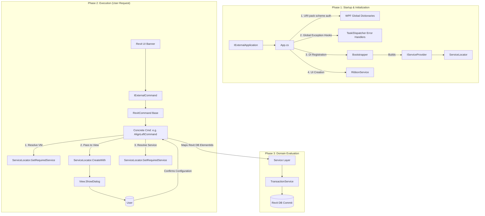

# System Architecture

> Auto-generated deep mapping on 2026-03-21

## System Overview

LECG Revit Addin is an inherently complex, enterprise-ready Revit 2026 application employing an ultra-decoupled **MVVM + Microsoft.Extensions.DependencyInjection** architecture. It abandons traditional "fat" Revit API implementations in favor of aggressively single-responsibility services. 

## Architectural Layers

### 1. Initialization and Core Identity (`App.cs`)
- **Fixing WPF Context within Revit:** During `OnStartup`, the app explicitly triggers `System.IO.Packaging.PackUriHelper.UriSchemePack` to circumvent WPF Pack URI failure states in .NET 8 / Revit 2026 context. 
- **Global Design Systems:** Programmatically injects `LecgTheme.xaml` into the WPF `Application.Current.Resources.MergedDictionaries`.
- **Defensive Error Hooking:** Aggressively traps `Dispatcher.CurrentDispatcher.UnhandledException`, `AppDomain.CurrentDomain.UnhandledException`, and `TaskScheduler.UnobservedTaskException` to prevent the host CAD application (Revit) from crashing silently.

### 2. Dependency Injection (`Bootstrapper.cs` & `ServiceLocator.cs`)
- **Container:** Utilizes `Microsoft.Extensions.DependencyInjection`.
- **Registration Topography:**
  - **Singletons (100+):** All business logic is stateless. Registered as scoped wrappers via `AddSingleton<IInterface, Implementation>()`. E.g., `IMaterialAssignmentExecutionService`, `ICadConversionService`.
  - **Transients:** `ViewModels` and `Views`. The GUI state is always fresh per invocation to prevent memory leaks from dangling Revit elements.
- **ServiceLocator:** Due to the param-less constructor requirement natively imposed by Revit on `IExternalCommand`, the application employs a Service Locator Anti-Pattern wrapper as an entry threshold bridge. `ActivatorUtilities.CreateInstance<T>` dynamically links injected runtime parameters. 

### 3. Execution Lifecycle (`RevitCommand.cs` & `*Command.cs`)
- **Transactions:** Marked `[Transaction(TransactionMode.Manual)]`. Execution bypasses automatic transaction scopes to maintain fine-grained locking.
- **Workflow Pattern:** 
  1. Retrieve pre-configured ViewModel.
  2. Instantiate concrete WPF `IWindow`/`View`.
  3. Block execution thread and await user configuration.
  4. Post-Dialog mapping of local arrays (`SelectedTargets`) into Revit Elements (`doc.GetElement`).
  5. Pass execution logic down to an isolated Interface Service.

### 4. Service Granularity (The 150+ Services Pattern)
The service layer executes **Extreme Single Responsibility (SRP)**. E.g., instead of one massive `CadExportService`, there is:
- `CadGeometryOptimizationService` (cleans coordinates)
- `CadTempFileCleanupService` (I/O garbage collection)
- `CadHatchRenderService` (GUI feedback state machine)
- `CadLineMergeService` (topological graph reduction)

By fracturing complexity this thinly, logic is easily isolated, independently logged via `ILogger`, and isolated for mock-free testing strategies.

## Data State & Persistance
1. `SettingsManager`: Abstracts `appdata/roaming` local configuration as persistent configurations linked directly into `ViewModel` default states.
2. `TransactionService`: Serves as the ultimate DB gatekeeper. Any structural modification on Element IDs must traverse `ITransactionService.Run` to wrap internal roll-backs, `FailureHandlingOptions`, and regen logic.

## Technical Debt Roadmap & Risk Exposure
1. Lack of `IDisposable` tracking across deep Transient resolution paths.
2. **Sub-Optimal Caching:** Heavy topological calculations (e.g., `Tessellation` operations inside CAD or `FixPoints`) regenerate calculation pipelines constantly. Needs a transient memory cache provider wrapper.
3. Complex command bootstrapping requires duplicating 5 to 6 lines per Command Entry Point. A MediatR implementation could decouple this completely logic.
