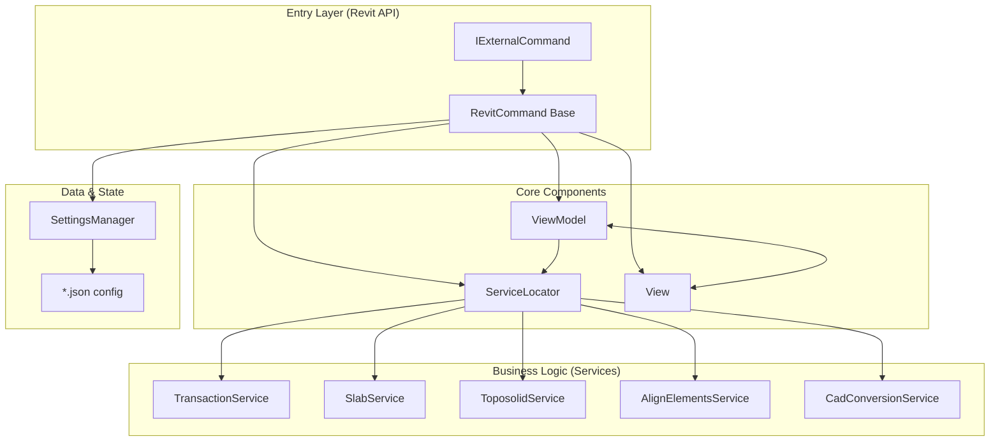

# Architecture

> Auto-generated by /map on 2026-03-20

## Overview

LECG Revit Addin is a high-performance BIM toolset targeting **Revit 2026**. It follows a strict **MVVM + Dependency Injection (DI)** architecture to ensure maintainability, testability, and a consistent user experience.

## Components

### RevitCommand (Core)
- **Purpose:** Abstract base class for all Revit external commands. Centralizes logging, error handling (`SafeFailureHandler`), and access to `ExternalCommandData`.
- **Location:** `src/Core/RevitCommand.cs`
- **Responsibilities:**
  - Initialization of the environment
  - UI invocation
  - Progress tracking through `UIDocument` status bar
  - Wrapping execution in top-level try-catch

### ServiceLocator (DI)
- **Purpose:** Central registry for all application services and view models. Uses a lightweight `SimpleDi` container.
- **Location:** `src/Core/ServiceLocator.cs`
- **Dependencies:** All interfaces in `src/Services/Interfaces/`

### Services Layer
- **Purpose:** Houses all Revit API interaction and complex geometry logic.
- **Interfaces:** `src/Services/Interfaces/*.cs` (e.g., `ISlabService`, `ITransactionService`)
- **Implementations:** `src/Services/*.cs`
- **Key Services:**
    - `TransactionService`: Manages all Revit `Transaction` and `TransactionGroup` lifecycles.
    - `SlabService`: Handles `Floor` and `Toposolid` slab shape editing and duplication.
    - `ToposolidService`: Logic for Toposolid-specific operations (contours, simplified points).

### MVVM Layer
- **ViewModels:** Inherit from `BaseViewModel` (using `CommunityToolkit.Mvvm`). They coordinate service calls and expose properties for UI binding.
- **Views:** WPF windows inheriting from `LecgWindow`. They follow a consistent design system (LecgColors, Animations) and open first before any Revit selection to ensure a "Setup First" interaction pattern.

## Data Flow

1. **Invoke**: User clicks ribbon button -> `IExternalCommand.Execute` called.
2. **Setup**: `RevitCommand` initializes -> `ServiceLocator` pulls the necessary `ViewModel` and `View`.
3. **Configure**: `SettingsManager` loads last used values into VM -> `View.ShowDialog()` displays config UI.
4. **Action**: User confirms -> `ViewModel` calls one or more **Services**.
5. **Transaction**: Services interact with Revit DB via `TransactionService.Run()`.
6. **Result**: Changes committed -> UI updated -> Log window shown if necessary.

## Technical Debt

- [ ] **Service Bloat**: Some services (e.g., `SlabService`) are becoming multi-purpose and should be split into smaller specialized services (e.g., `DeduplicationService`).
- [ ] **SelectionCoordinator**: Current selection logic is coupled with view models, should move to its own coordinator service for better reuse.
- [ ] **In-memory cache**: No centralized caching strategy for Revit elements during complex multi-step operations.

## Conventions

- **Naming:** Commands end in `Command.cs`, Services in `Service.cs`, ViewModels in `ViewModel.cs`, Views in `View.xaml`.
- **Structure:** Feature folders (src/Commands, src/Services, etc.) are organized by role.
- **Transactions:** NEVER open a transaction directly; always use `ITransactionService.Run`.
- **UI:** No logic in code-behind; use `RelayCommand` and bindings.
