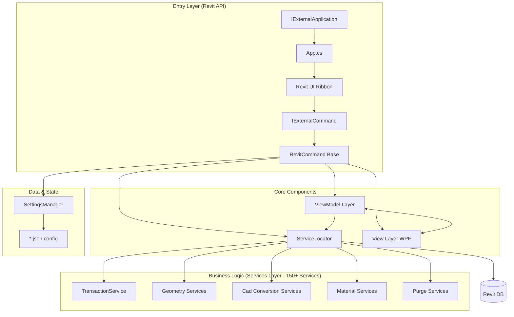

# Architecture

> Auto-generated by /map on 2026-03-21

## Overview

LECG Revit Addin is a high-performance BIM toolset targeting **Revit 2026**. It follows a strict **MVVM + Dependency Injection (DI)** architecture to ensure maintainability, testability, and a consistent user experience. The system is designed around highly decoupled Single Responsibility services.

## Components

### Entry Points
- **App.cs:** Implements `IExternalApplication` to build the custom Revit Ribbon and register commands.
- **Commands (src/Commands/):** ~29 commands implementing `IExternalCommand` through the `RevitCommand` base class.

### RevitCommand (Core)
- **Purpose:** Abstract base class for all Revit external commands. Centralizes logging, error handling, and `ExternalCommandData` access.
- **Location:** `src/Core/RevitCommand.cs`

### Service Layer (Business Logic)
- **Purpose:** Houses all Revit API interaction, complex geometry logic, CAD conversion logic, and deep purge logic.
- **Location:** `src/Services/*.cs` (approx. 153 isolated services for Single Responsibility).
- **Key Sub-systems:**
  - `TransactionService`: Manages all Revit `Transaction` lifecycles safely.
  - Geometry: `SlabService`, `ToposolidService`, `SplitBoundariesService`.
  - Cad Conversion: `CadConversionService`, `CadFamilyBuildService`, etc.
  - Deep Purge: `PurgeService`, `DeepPurgeService`, specialized rule services.
  - Materials: PBR creation, `MaterialService`, texture mapping.

### MVVM Layer
- **ViewModels (`src/ViewModels/`):** Coordinate logic. Inherit from `ObservableObject` or similar from `CommunityToolkit.Mvvm`.
- **Views (`src/Views/`):** 40+ WPF UserControls/Windows defining the complex UI for the commands.

## Data Flow

1. **Invoke**: User clicks ribbon button -> `IExternalCommand.Execute` called.
2. **Setup**: `RevitCommand` initializes -> `ServiceLocator` pulls the necessary `ViewModel` and `View`.
3. **Configure**: `SettingsManager` loads last used values into VM -> `View.ShowDialog()` displays configuration Window.
4. **Action**: User confirms -> `ViewModel` delegates execution to specialized **Services**.
5. **Transaction**: Services interact with Revit DB exclusively via `TransactionService`.
6. **Result**: Changes committed -> UI updated -> Results mapped, errors logged.

## Integration Points

| Service / API | Type | Purpose |
|---------------|------|---------|
| Revit API | Native | Reading and writing Element Geometry, Types, and Parameters |
| Local File System | I/O | Reading/writing CAD links, Family Templates, JSON Settings |

## Conventions
- **Naming:** Command classes end in `Command`, Services in `Service`, UI in `View` / `ViewModel`.
- **DI Container:** Interfaces resolve to implementations uniformly via a lightweight Dependency Injection framework.
- **Transactions:** NEVER open a transaction manually; use `TransactionService`.

## Technical Debt

- [ ] **Geometry Coupling**: Some complex services (e.g. `FixPointsService` and `SplitBoundariesService`) contain dense topological logic that might be difficult to test.
- [ ] **Testing**: Minimal or missing unit tests for the core geometry calculations.
- [ ] **Service Bloat**: With 153 services, discovering the correct service interface requires strict search-first discipline.
