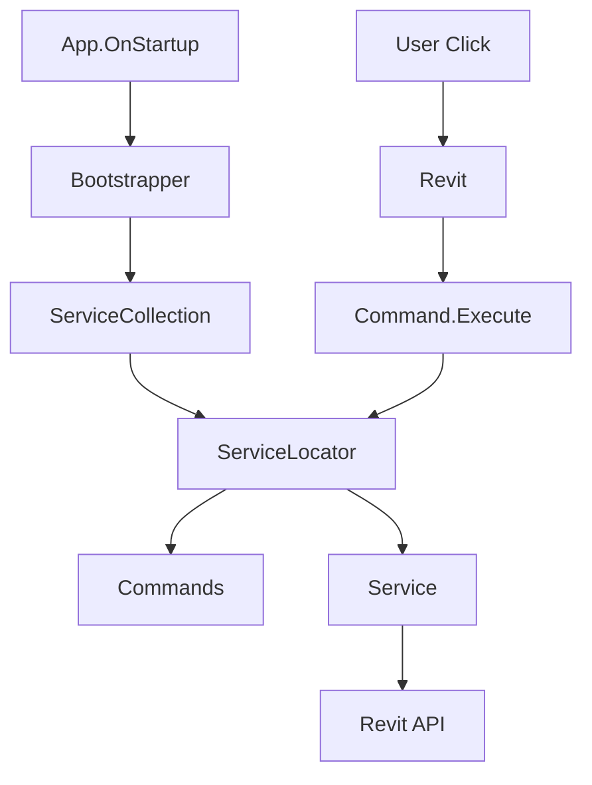

# Refactoring Roadmap

## Document Purpose

This document provides a prioritized list of improvements for the LECG Revit plugin, with effort estimates, impact analysis, and implementation strategies.

**Last Updated**: February 2026

---

## Overview

The LECG plugin is well-architected and maintainable. This roadmap focuses on **completing existing patterns** and **reducing technical debt** rather than major architectural changes.

**Total Estimated Effort**: ~40-60 hours over 3 months

---

## Priority Matrix

```
High Impact    │ P1: DI Registration    │ P4: Unit Tests        │
              │ P2: Consolidate        │                       │
              │     Interfaces         │                       │
───────────────┼────────────────────────┼───────────────────────┤
              │ P3: Clean Build        │ P5: Decompose         │
Low Impact    │     Artifacts          │     Large Services    │
              │ P6: Fix Warnings       │                       │
              │                        │                       │
              └────────────────────────┴───────────────────────┘
                Low Effort              High Effort
```

---

## Phase 1: Quick Wins (Week 1)

### P1: Complete DI Registration

**Priority**: 🔴 High
**Effort**: 4 hours
**Impact**: High (consistency, maintainability)

**Current State**:
- 13/13 Services registered ✅
- 16/16 feature ViewModels registered ✅
- 18/18 Views registered ✅
- Commands resolve registered View/ViewModel types via `ServiceLocator` ✅

**Goal**: Register all ViewModels and Views in DI container and remove direct `new` usage for registered UI types in commands

**Implementation**:

**Step 1**: Register ViewModels in `Bootstrapper.ConfigureViewModels()`:

```csharp
private static void ConfigureViewModels(IServiceCollection services)
{
    // Already registered
    services.AddTransient<ResetSlabsVM>();
    services.AddTransient<ConvertFamilyViewModel>();
    services.AddTransient<ConvertCadViewModel>();

    // Add these:
    services.AddTransient<SexyRevitViewModel>();
    services.AddTransient<PurgeViewModel>();
    services.AddTransient<SearchReplaceViewModel>();
    services.AddTransient<AssignMaterialViewModel>();
    services.AddTransient<OffsetElevationsVM>();
    services.AddTransient<AlignEdgesViewModel>();
    services.AddTransient<UpdateContoursViewModel>();
    services.AddTransient<ChangeLevelViewModel>();
    services.AddTransient<AlignElementsViewModel>();
    services.AddTransient<SimplifyPointsViewModel>();
    services.AddTransient<FilterCopyViewModel>();
    services.AddTransient<LogViewModel>();
    services.AddTransient<RenderAppearanceViewModel>();
}
```

**Step 2**: Register Views in `Bootstrapper.ConfigureViews()`:

```csharp
private static void ConfigureViews(IServiceCollection services)
{
    // Already registered
    services.AddTransient<Views.ResetSlabsView>();

    // Add these:
    services.AddTransient<Views.SexyRevitView>();
    services.AddTransient<Views.PurgeView>();
    services.AddTransient<Views.SearchReplaceView>();
    services.AddTransient<Views.AssignMaterialView>();
    services.AddTransient<Views.OffsetElevationsView>();
    services.AddTransient<Views.AlignEdgesView>();
    services.AddTransient<Views.UpdateContoursView>();
    services.AddTransient<Views.ChangeLevelView>();
    services.AddTransient<Views.AlignElementsView>();
    services.AddTransient<Views.SimplifyPointsView>();
    services.AddTransient<Views.FilterCopyView>();
    services.AddTransient<Views.ConvertCadView>();
    services.AddTransient<Views.ConvertFamilyView>();
    services.AddTransient<Views.LogView>();
    services.AddTransient<Views.HomeView>();
    services.AddTransient<Views.AlignDashboardView>();
    services.AddTransient<Views.RenderAppearanceView>();
}
```

**Step 3**: Update commands to use ServiceLocator for registered View/ViewModel types:

Implemented pattern:
```csharp
var vm = ServiceLocator.GetRequiredService<SexyRevitViewModel>();
var view = ServiceLocator.CreateWith<Views.SexyRevitView>(vm);

// For constructors needing runtime Revit values:
var vm2 = ServiceLocator.CreateWith<ChangeLevelViewModel>(doc, service);
var view2 = ServiceLocator.CreateWith<Views.ChangeLevelView>(vm2, uiDoc);
```

For settings-backed commands, persisted values are loaded then copied into a DI-resolved VM instance before dialog display.

**Benefits**:
- Consistent DI usage across all components
- Easier to add dependencies to ViewModels/Views in future
- Better testability

**Risk**: Low (backward compatible, incremental change)

---

### P2: Consolidate Interface Locations ✅ Completed

**Priority**: 🟡 Medium
**Effort**: 1 hour
**Impact**: Medium (consistency, clarity)

**Current State**:
- All service interfaces are in `src/Services/Interfaces/`
- The legacy interface folder is no longer used
- All interface declarations use `namespace LECG.Services.Interfaces`
- Interface consumers use `using LECG.Services.Interfaces;`

**Goal**: All interfaces in `src/Services/Interfaces/` with a single namespace rule

**Final Rule**:
```csharp
namespace LECG.Services.Interfaces
```

Use interfaces via:
```csharp
using LECG.Services.Interfaces;
```

**Verification**:
- `dotnet build -c Debug` succeeds

**Benefits**:
- Clear, consistent location for all interfaces
- Easier for new developers to find interfaces
- Cleaner project structure

**Risk**: Very Low (find/replace operation, compiler will catch any issues)

---

### P3: Clean Up Build Artifacts ✅ Completed

**Priority**: 🟡 Medium
**Effort**: 30 minutes
**Impact**: Medium (repository cleanliness, security)

**Current State**:
- Build/journal/crash logs are stored in `build_logs/`
- Root is clean of P3 artifact patterns
- `.gitignore` blocks future commits of these artifacts

**Goal**: Keep build artifacts out of repository root and prevent future commits

**Implementation**:

**Step 1**: Create `build_logs/` directory:
```bash
mkdir build_logs
```

**Step 2**: Move log files:
```bash
mv build_*.txt build_*.log crash*.txt journal*.txt *.log build_logs/
```

**Step 3**: Update `.gitignore`:
```gitignore
# Build logs
build_logs/
*.log
*_err_*.txt
journal*.txt
crash*.txt
diag.log
build_*.txt

# Keep specific logs if needed:
# !important_log.txt
```

**Step 4**: Remove from Git history (optional):
```bash
git rm --cached build_*.txt build_*.log crash*.txt
git commit -m "Remove build artifacts from repository"
```

**Benefits**:
- Cleaner repository
- Reduced risk of committing sensitive data (project paths, etc.)
- Smaller clone size

**Risk**: None (logs are temporary)

---

### P6: Fix Nullable Reference Warnings

**Priority**: 🟢 Low
**Effort**: 15 minutes
**Impact**: Low (code quality)
**Status**: Completed

**Current State**:
- CS86xx warnings: 0
- Verified with `dotnet build -c Debug` (`0 Warning(s), 0 Error(s)`)

**Goal**: Maintain zero nullable/build warnings

**Implementation**:

**Option 1**: Add null-forgiving operators:
```csharp
// Line 17
if (requestedName.Name != null && requestedName.Name.StartsWith("Microsoft.Extensions.DependencyInjection"))

// Lines 26-29
string? folderPath = Path.GetDirectoryName(Assembly.GetExecutingAssembly().Location);
if (string.IsNullOrEmpty(folderPath)) return null;

string assemblyPath = Path.Combine(folderPath!, requestedName.Name + ".dll");
```

**Option 2**: Restructure to avoid warnings:
```csharp
// Line 17-24
var requestedName = new AssemblyName(args.Name);
if (requestedName.Name == null) return null;

if (requestedName.Name.StartsWith("Microsoft.Extensions.DependencyInjection"))
{
    // ...
}

// Lines 26-31
string? folderPath = Path.GetDirectoryName(Assembly.GetExecutingAssembly().Location);
if (folderPath == null) return null;

string assemblyPath = Path.Combine(folderPath, requestedName.Name + ".dll");
```

**Benefits**:
- Zero warnings build
- Cleaner code quality metrics

**Risk**: None (code behavior unchanged)

---

## Phase 2: Foundation (Weeks 2-4)

### P4: Add Unit Test Project

**Priority**: 🔴 High
**Effort**: 16-24 hours
**Impact**: Very High (quality, confidence)
**Status**: Completed
**Current State**:
- `LECG.Tests` xUnit project added to solution with initial Services/ViewModels/Helpers structure
- Initial unit tests execute with `dotnet test` from repository root (no Revit process required)
- Verification commands: `dotnet build -c Debug`, `dotnet test`
**Goal**: Test project with >70% coverage for services

**Implementation**:

**Step 1**: Create test project:
```bash
dotnet new xunit -n LECG.Tests
dotnet sln add LECG.Tests/LECG.Tests.csproj
```

**Step 2**: Add dependencies to `LECG.Tests.csproj`:
```xml
<ItemGroup>
  <PackageReference Include="xunit" Version="2.6.5" />
  <PackageReference Include="xunit.runner.visualstudio" Version="2.5.6" />
  <PackageReference Include="Moq" Version="4.20.70" />
  <PackageReference Include="FluentAssertions" Version="6.12.0" />
</ItemGroup>

<ItemGroup>
  <ProjectReference Include="..\LECG\LECG.csproj" />
</ItemGroup>
```

**Step 3**: Create test structure:
```
LECG.Tests/
├── Services/
│   ├── SexyRevitServiceTests.cs
│   ├── MaterialServiceTests.cs
│   └── ...
├── ViewModels/
│   ├── SexyRevitViewModelTests.cs
│   └── ...
└── Helpers/
    └── MockHelpers.cs
```

**Step 4**: Write tests for each service:

**Example** (`SexyRevitServiceTests.cs`):
```csharp
public class SexyRevitServiceTests
{
    [Fact]
    public void ApplyBeauty_WhenUseConsistentColors_SetsDisplayStyleToRealistic()
    {
        // Arrange
        var mockDoc = new Mock<Document>();
        var mockView = new Mock<View>();
        mockView.SetupProperty(v => v.DisplayStyle);

        var settings = new SexyRevitViewModel { UseConsistentColors = true };
        var service = new SexyRevitService();

        // Act
        service.ApplyBeauty(mockDoc.Object, mockView.Object, settings);

        // Assert
        mockView.Object.DisplayStyle.Should().Be(DisplayStyle.Realistic);
    }

    [Fact]
    public void ApplyBeauty_CallsLogCallback_WithCorrectMessages()
    {
        // Arrange
        var mockDoc = new Mock<Document>();
        var mockView = new Mock<View>();
        var logMessages = new List<string>();

        var settings = new SexyRevitViewModel { UseConsistentColors = true };
        var service = new SexyRevitService();

        // Act
        service.ApplyBeauty(mockDoc.Object, mockView.Object, settings, msg => logMessages.Add(msg));

        // Assert
        logMessages.Should().Contain(msg => msg.Contains("GRAPHICS"));
    }
}
```

**Step 5**: Run tests:
```bash
dotnet test
```

**Step 6**: Measure coverage (using Coverlet):
```bash
dotnet test /p:CollectCoverage=true
```

**Prioritize Testing**:
1. **Services** (highest value) - 100% interface-based, easily mockable
2. **ViewModels** (medium value) - UI logic, property change notifications
3. **Commands** (low value) - thin orchestrators, harder to test

**Benefits**:
- Confidence in refactoring
- Catch regressions early
- Document expected behavior
- Enable CI/CD

**Risk**: Medium (initial setup time, learning curve for Revit API mocking)

**Estimated Coverage Targets**:
- Phase 1: 40% (core services)
- Phase 2: 70% (all services + critical ViewModels)
- Phase 3: 85% (comprehensive)

---

## Phase 3: Optimization (Weeks 5-8)

### P5: Decompose Large Services

**Priority**: 🟡 Medium
**Effort**: 8 hours
**Impact**: Medium (maintainability, testability)
**Status**: Slice 90 completed

**P5 Slice 1 (Completed)**:
- Added `LECG.Core` (`net8.0`) as a Revit/WPF-free core layer.
- Moved Sexy Revit graphics decision logic into `LECG.Core.Graphics.SexyRevitGraphicsPolicy`.
- Updated `LECG.Tests` to reference `LECG.Core` (not `LECG.csproj`).
- Added CI workflow to build/test only `LECG.Core` + `LECG.Tests` on `windows-latest`.

**CI Decision (Final)**:
- CI runs on `windows-latest` without Revit installed.
- CI validates core + tests only.
- Full plugin build (`LECG.csproj`) remains local/Revit-installed or self-hosted.

**P5 Slice 2 (Completed)**:
- Extracted deterministic rename rule logic into `LECG.Core.Rename.RenameRuleEngine`.
- Updated plugin `src/Services/RenameRules.cs` rule implementations to delegate compute logic to Core.
- Added/expanded core tests in `LECG.Tests/Services/RenameRuleEngineTests.cs`.
- `dotnet test` continues to run against `LECG.Core` + `LECG.Tests` without plugin dependency.

**P5 Slice 3 (Completed)**:
- Decomposed `CadConversionService` by extracting placement-view selection into `ICadPlacementViewService`.
- Added `CadPlacementViewService` and wired it through DI + `CadConversionService` constructor injection.
- Kept behavior unchanged while reducing `CadConversionService` responsibility.

**P5 Slice 4 (Completed)**:
- Decomposed `CadConversionService` by extracting family symbol selection/activation into `ICadFamilySymbolService`.
- Added `CadFamilySymbolService` and wired it through DI + `CadConversionService` constructor injection.
- Kept behavior unchanged while reducing `CadConversionService` responsibility.

**P5 Slice 5 (Completed)**:
- Decomposed `CadConversionService` by extracting detail line style creation/update into `ICadLineStyleService`.
- Added `CadLineStyleService` and wired it through DI + `CadConversionService` constructor injection.
- Kept behavior unchanged while reducing `CadConversionService` responsibility.

**P5 Slice 6 (Completed)**:
- Decomposed `MaterialService` by extracting render-appearance sync logic into `IRenderAppearanceService`.
- Added `RenderAppearanceService` and wired it through DI + `MaterialService` constructor injection.
- Kept `IMaterialService` API unchanged while reducing `MaterialService` responsibility.

**P5 Slice 7 (Completed)**:
- Decomposed `PurgeService` by extracting reference-ID scanning into `IPurgeReferenceScannerService`.
- Added `PurgeReferenceScannerService` and wired it through DI + `PurgeService` constructor injection.
- Kept `IPurgeService` API unchanged while reducing `PurgeService` helper responsibilities.

**P5 Slice 8 (Completed)**:
- Decomposed `CadConversionService` by extracting collinear line merge logic into `ICadLineMergeService`.
- Added `CadLineMergeService` and wired it through DI + `CadConversionService` constructor injection.
- Kept `ICadConversionService` API unchanged while reducing geometry optimization helper responsibilities.

**P5 Slice 9 (Completed)**:
- Decomposed `PurgeService` by extracting unused-material purge logic into `IPurgeMaterialService`.
- Added `PurgeMaterialService` and wired it through DI + `PurgeService` constructor injection.
- Kept `IPurgeService` API unchanged while reducing `PurgeService` method complexity.

**P5 Slice 10 (Completed)**:
- Decomposed `MaterialService` by extracting type assignment logic into `IMaterialTypeAssignmentService`.
- Added `MaterialTypeAssignmentService` and wired it through DI + `MaterialService` constructor injection.
- Kept `IMaterialService` API unchanged while reducing `MaterialService` method complexity.

**P5 Slice 11 (Completed)**:
- Decomposed `CadConversionService` by extracting curve flatten/tessellation logic into `ICadCurveFlattenService`.
- Added `CadCurveFlattenService` and wired it through DI + `CadConversionService` constructor injection.
- Kept `ICadConversionService` API unchanged while reducing geometry helper complexity.

**P5 Slice 12 (Completed)**:
- Decomposed `CadConversionService` by extracting filled region type resolution/creation into `ICadFilledRegionTypeService`.
- Added `CadFilledRegionTypeService` and wired it through DI + `CadConversionService` constructor injection.
- Kept `ICadConversionService` API unchanged while reducing hatch/filled-region helper complexity.

**P5 Slice 13 (Completed)**:
- Decomposed `PurgeService` by extracting line-style purge logic into `IPurgeLineStyleService`.
- Added `PurgeLineStyleService` and wired it through DI + `PurgeService` constructor injection.
- Kept `IPurgeService` API unchanged while reducing method complexity in `PurgeService`.

**P5 Slice 14 (Completed)**:
- Decomposed `CadConversionService` by extracting family load/place orchestration into `ICadFamilyLoadPlacementService`.
- Added `CadFamilyLoadPlacementService` and wired it through DI + `CadConversionService` constructor injection.
- Kept `ICadConversionService` API unchanged while reducing load/place helper complexity.

**P5 Slice 15 (Completed)**:
- Decomposed `CadConversionService` by extracting geometry parsing/extraction into `ICadGeometryExtractionService`.
- Added `CadGeometryExtractionService` and wired it through DI + `CadConversionService` constructor injection.
- Kept `ICadConversionService` API unchanged while reducing geometry extraction helper complexity.

**P5 Slice 16 (Completed)**:
- Decomposed `MaterialService` by extracting material create/update logic into `IMaterialCreationService`.
- Added `MaterialCreationService` and wired it through DI + `MaterialService` constructor injection.
- Kept `IMaterialService` API unchanged while reducing material creation helper complexity.

**P5 Slice 17 (Completed)**:
- Decomposed `PurgeService` by extracting fill-pattern purge logic into `IPurgeFillPatternService`.
- Added `PurgeFillPatternService` and wired it through DI + `PurgeService` constructor injection.
- Kept `IPurgeService` API unchanged while reducing fill-pattern purge method complexity.

**P5 Slice 18 (Completed)**:
- Decomposed `AlignEdgesService` by extracting reference raycast/hit-point helpers into `IReferenceRaycastService`.
- Added `ReferenceRaycastService` and wired it through DI + `AlignEdgesService` constructor injection.
- Kept `IAlignEdgesService` API unchanged while reducing raycast helper complexity in `AlignEdgesService`.

**P5 Slice 19 (Completed)**:
- Decomposed `AlignEdgesService` by extracting intersector creation (reference IDs + 3D view resolution) into `IAlignEdgesIntersectorService`.
- Added `AlignEdgesIntersectorService` and wired it through DI + `AlignEdgesService` constructor injection.
- Kept `IAlignEdgesService` API unchanged while reducing setup/orchestration complexity in `AlignEdgesService`.

**P5 Slice 20 (Completed)**:
- Decomposed `SearchReplaceService` by extracting rename rule pipeline application into `IRenameRulePipelineService`.
- Added `RenameRulePipelineService` and wired it through DI + `SearchReplaceService` constructor injection.
- Kept `ISearchReplaceService` API unchanged while reducing transformation pipeline complexity.

**P5 Slice 21 (Completed)**:
- Decomposed `AlignEdgesService` by extracting boundary sampling/densification point collection into `IAlignEdgesBoundaryPointService`.
- Added `AlignEdgesBoundaryPointService` and wired it through DI + `AlignEdgesService` constructor injection.
- Kept `IAlignEdgesService` API unchanged while reducing boundary processing complexity.

**P5 Slice 22 (Completed)**:
- Decomposed `MaterialService` by extracting color sequence state/palette logic into `IMaterialColorSequenceService`.
- Added `MaterialColorSequenceService` and wired it through DI + `MaterialService` constructor injection.
- Kept `IMaterialService` API unchanged while reducing stateful color selection complexity.

**P5 Slice 23 (Completed)**:
- Decomposed `FamilyConversionService` by extracting template path resolution into `IFamilyTemplatePathService`.
- Added `FamilyTemplatePathService` and wired it through DI + `FamilyConversionService` constructor injection.
- Kept `IFamilyConversionService` API unchanged while reducing template path resolution complexity.

**P5 Slice 24 (Completed)**:
- Decomposed `MaterialService` by extracting PBR material creation into `IMaterialPbrService`.
- Added `MaterialPbrService` and wired it through DI + `MaterialService` constructor injection.
- Kept `IMaterialService` API unchanged while reducing PBR pipeline complexity.

**P5 Slice 25 (Completed)**:
- Decomposed `SearchReplaceService` by extracting batch rename execution into `IBatchRenameExecutionService`.
- Added `BatchRenameExecutionService` and wired it through DI + `SearchReplaceService` constructor injection.
- Kept `ISearchReplaceService` API unchanged while reducing transaction/rename execution complexity.

**P5 Slice 26 (Completed)**:
- Decomposed `PurgeService` by extracting level purge logic into `IPurgeLevelService`.
- Added `PurgeLevelService` and wired it through DI + `PurgeService` constructor injection.
- Kept `IPurgeService` API unchanged while reducing level purge complexity.

**P5 Slice 27 (Completed)**:
- Decomposed `SearchReplaceService` by extracting base element collection into `IBaseElementCollectionService`.
- Added `BaseElementCollectionService` and wired it through DI + `SearchReplaceService` constructor injection.
- Kept `ISearchReplaceService` API unchanged while reducing data collection complexity.

**P5 Slice 28 (Completed)**:
- Decomposed `MaterialService` by extracting element grouping-by-type into `IMaterialElementGroupingService`.
- Added `MaterialElementGroupingService` and wired it through DI + `MaterialService` constructor injection.
- Kept `IMaterialService` API unchanged while reducing selection grouping complexity.

**P5 Slice 29 (Completed)**:
- Decomposed `FamilyConversionService` by extracting family geometry element ID collection into `IFamilyGeometryCollectionService`.
- Added `FamilyGeometryCollectionService` and wired it through DI + `FamilyConversionService` constructor injection.
- Kept `IFamilyConversionService` API unchanged while reducing geometry selection complexity.

**P5 Slice 30 (Completed)**:
- Decomposed `CadConversionService` by extracting family drawing view resolution into `ICadDrawingViewService`.
- Added `CadDrawingViewService` and wired it through DI + `CadConversionService` constructor injection.
- Kept `ICadConversionService` API unchanged while reducing drawing orchestration complexity.

**P5 Slice 31 (Completed)**:
- Decomposed `FamilyConversionService` by extracting temp family file cleanup into `IFamilyTempFileCleanupService`.
- Added `FamilyTempFileCleanupService` and wired it through DI + `FamilyConversionService` constructor injection.
- Kept `IFamilyConversionService` API unchanged while reducing conversion finalization complexity.

**P5 Slice 32 (Completed)**:
- Decomposed `AlignEdgesService` by extracting toposolid base elevation resolution into `IToposolidBaseElevationService`.
- Added `ToposolidBaseElevationService` and wired it through DI + `AlignEdgesService` constructor injection.
- Kept `IAlignEdgesService` API unchanged while reducing elevation-calculation complexity.

**P5 Slice 33 (Completed)**:
- Decomposed `RenderAppearanceService` by extracting solid fill pattern lookup/creation into `IRenderSolidFillPatternService`.
- Added `RenderSolidFillPatternService` and wired it through DI + `RenderAppearanceService` constructor injection.
- Kept `IRenderAppearanceService` API unchanged while reducing fill-pattern orchestration complexity.

**P5 Slice 34 (Completed)**:
- Decomposed `SchemaCleanerService` by extracting third-party schema vendor filtering into `ISchemaVendorFilterService`.
- Added `SchemaVendorFilterService` and wired it through DI + `SchemaCleanerService` constructor injection.
- Kept `ISchemaCleanerService` API unchanged while reducing schema-classification complexity.

**P5 Slice 35 (Completed)**:
- Decomposed `MaterialService` by extracting assignment orchestration into `IMaterialAssignmentExecutionService`.
- Added `MaterialAssignmentExecutionService` and wired it through DI + `MaterialService` constructor injection.
- Kept `IMaterialService` API unchanged while reducing assignment workflow complexity.

**P5 Slice 36 (Completed)**:
- Decomposed `FamilyConversionService` by extracting family load options creation into `IFamilyLoadOptionsFactory`.
- Added `FamilyLoadOptionsFactory` and wired it through DI + `FamilyConversionService` constructor injection.
- Kept `IFamilyConversionService` API unchanged while reducing project-load policy wiring complexity.

**P5 Slice 37 (Completed)**:
- Decomposed `CadConversionService` by extracting family save/close behavior into `ICadFamilySaveService`.
- Added `CadFamilySaveService` and wired it through DI + `CadConversionService` constructor injection.
- Kept `ICadConversionService` API unchanged while reducing save pipeline orchestration complexity.

**P5 Slice 38 (Completed)**:
- Decomposed `CadConversionService` by extracting geometry optimization into `ICadGeometryOptimizationService`.
- Added `CadGeometryOptimizationService` and wired it through DI + `CadConversionService` constructor injection.
- Kept `ICadConversionService` API unchanged while reducing geometry preprocessing complexity.

**P5 Slice 39 (Completed)**:
- Decomposed `CadConversionService` by extracting curve rendering into `ICadCurveRenderService`.
- Added `CadCurveRenderService` and wired it through DI + `CadConversionService` constructor injection.
- Kept `ICadConversionService` API unchanged while reducing curve-drawing orchestration complexity.

**P5 Slice 40 (Completed)**:
- Decomposed `CadConversionService` by extracting hatch rendering into `ICadHatchRenderService`.
- Added `CadHatchRenderService` and wired it through DI + `CadConversionService` constructor injection.
- Kept `ICadConversionService` API unchanged while reducing hatch-drawing orchestration complexity.

**P5 Slice 41 (Completed)**:
- Decomposed `FamilyConversionService` by extracting target family parameter setup into `IFamilyParameterSetupService`.
- Added `FamilyParameterSetupService` and wired it through DI + `FamilyConversionService` constructor injection.
- Kept `IFamilyConversionService` API unchanged while reducing family-parameter setup complexity.

**P5 Slice 42 (Completed)**:
- Decomposed `RenderAppearanceService` by extracting material sync checks into `IRenderMaterialSyncCheckService`.
- Added `RenderMaterialSyncCheckService` and wired it through DI + `RenderAppearanceService` constructor injection.
- Kept `IRenderAppearanceService` API unchanged while reducing sync-validation complexity.

**P5 Slice 43 (Completed)**:
- Decomposed `CadConversionService` by extracting draw-context creation into `ICadRenderContextService`.
- Added `CadRenderContextService` and wired it through DI + `CadConversionService` constructor injection.
- Kept `ICadConversionService` API unchanged while reducing render-setup orchestration complexity.

**P5 Slice 44 (Completed)**:
- Decomposed `FamilyConversionService` by extracting project-family loading into `IFamilyProjectLoadService`.
- Added `FamilyProjectLoadService` and wired it through DI + `FamilyConversionService` constructor injection.
- Kept `IFamilyConversionService` API unchanged while reducing project-load transaction complexity.

**P5 Slice 45 (Completed)**:
- Decomposed `SchemaCleanerService` by extracting DataStorage schema scanning into `ISchemaDataStorageScanService`.
- Added `SchemaDataStorageScanService` and wired it through DI + `SchemaCleanerService` constructor injection.
- Kept `ISchemaCleanerService` API unchanged while reducing DataStorage scan orchestration complexity.

**P5 Slice 46 (Completed)**:
- Decomposed `AlignEdgesService` by extracting vertex alignment into `IAlignEdgesVertexAlignmentService`.
- Added `AlignEdgesVertexAlignmentService` and wired it through DI + `AlignEdgesService` constructor injection.
- Kept `IAlignEdgesService` API unchanged while reducing vertex-adjustment orchestration complexity.

**P5 Slice 47 (Completed)**:
- Decomposed `PurgeService` by extracting summary/progress reporting into `IPurgeSummaryService`.
- Added `PurgeSummaryService` and wired it through DI + `PurgeService` constructor injection.
- Kept `IPurgeService` API unchanged while reducing summary-reporting orchestration complexity.

**P5 Slice 48 (Completed)**:
- Decomposed `SexyRevitService` by extracting sun-settings application into `ISexySunSettingsService`.
- Added `SexySunSettingsService` and wired it through DI + `SexyRevitService` constructor injection.
- Kept `ISexyRevitService` API unchanged while reducing sun-settings orchestration complexity.

**P5 Slice 49 (Completed)**:
- Decomposed `SexyRevitService` by extracting category visibility hiding into `ISexyCategoryVisibilityService`.
- Added `SexyCategoryVisibilityService` and wired it through DI + `SexyRevitService` constructor injection.
- Kept `ISexyRevitService` API unchanged while reducing category-visibility orchestration complexity.

**P5 Slice 50 (Completed)**:
- Decomposed `SexyRevitService` by extracting section box visibility handling into `ISexySectionBoxVisibilityService`.
- Added `SexySectionBoxVisibilityService` and wired it through DI + `SexyRevitService` constructor injection.
- Kept `ISexyRevitService` API unchanged while reducing section-box orchestration complexity.

**P5 Slice 51 (Completed)**:
- Decomposed `PurgeService` by extracting pass/category messaging into `IPurgePassMessagingService`.
- Added `PurgePassMessagingService` and wired it through DI + `PurgeService` constructor injection.
- Kept `IPurgeService` API unchanged while reducing pass-loop messaging orchestration complexity.

**P5 Slice 52 (Completed)**:
- Decomposed `PurgeService` by extracting fixed pass sequencing into `IPurgePassSequenceService`.
- Added `PurgePassSequenceService` and wired it through DI + `PurgeService` constructor injection.
- Kept `IPurgeService` API unchanged while reducing pass-iteration orchestration complexity.

**P5 Slice 53 (Completed)**:
- Decomposed `CadConversionService` by extracting CAD data drawing orchestration into `ICadDataDrawService`.
- Added `CadDataDrawService` and wired it through DI + `CadConversionService` constructor injection.
- Kept `ICadConversionService` API unchanged while reducing draw-pipeline orchestration complexity.

**P5 Slice 54 (Completed)**:
- Decomposed `RenderAppearanceService` by extracting render-appearance refresh/toggle flow into `IRenderAppearanceRefreshService`.
- Added `RenderAppearanceRefreshService` and wired it through DI + `RenderAppearanceService` constructor injection.
- Kept `IRenderAppearanceService` API unchanged while reducing refresh orchestration complexity.

**P5 Slice 55 (Completed)**:
- Decomposed `RenderAppearanceService` by extracting material graphics assignment into `IRenderMaterialGraphicsApplyService`.
- Added `RenderMaterialGraphicsApplyService` and wired it through DI + `RenderAppearanceService` constructor injection.
- Kept `IRenderAppearanceService` API unchanged while reducing per-material assignment orchestration complexity.

**P5 Slice 56 (Completed)**:
- Decomposed `PurgeService` by extracting per-pass execution into `IPurgePassExecutionService`.
- Added `PurgePassExecutionService` and wired it through DI + `PurgeService` constructor injection.
- Kept `IPurgeService` API unchanged while reducing pass-body orchestration complexity.

**P5 Slice 57 (Completed)**:
- Decomposed `MaterialPbrService` by extracting texture file lookup into `IMaterialTextureLookupService`.
- Added `MaterialTextureLookupService` and wired it through DI + `MaterialPbrService` constructor injection.
- Kept `IMaterialPbrService` API unchanged while reducing texture-lookup orchestration complexity.

**P5 Slice 58 (Completed)**:
- Decomposed `MaterialPbrService` by extracting bitmap property setup into `IMaterialBitmapPropertyService`.
- Added `MaterialBitmapPropertyService` and wired it through DI + `MaterialPbrService` constructor injection.
- Kept `IMaterialPbrService` API unchanged while reducing bitmap-property orchestration complexity.

**P5 Slice 59 (Completed)**:
- Decomposed `FamilyConversionService` by extracting temp family save behavior into `IFamilySaveService`.
- Added `FamilySaveService` and wired it through DI + `FamilyConversionService` constructor injection.
- Kept `IFamilyConversionService` API unchanged while reducing save-stage orchestration complexity.

**P5 Slice 60 (Completed)**:
- Decomposed `AlignElementsService` by extracting alignment translation calculation into `IAlignElementsTranslationService`.
- Added `AlignElementsTranslationService` and wired it through DI + `AlignElementsService` constructor injection.
- Kept `IAlignElementsService` API unchanged while reducing alignment switch orchestration complexity.

**P5 Slice 61 (Completed)**:
- Decomposed `FamilyConversionService` by extracting target-family document creation/validation into `IFamilyTargetDocumentService`.
- Added `FamilyTargetDocumentService` and wired it through DI + `FamilyConversionService` constructor injection.
- Kept `IFamilyConversionService` API unchanged while reducing target-document creation orchestration complexity.

**P5 Slice 62 (Completed)**:
- Decomposed `AlignElementsService` by extracting distribution item build/sort into `IAlignElementsDistributionItemService`.
- Added `AlignElementsDistributionItemService` and wired it through DI + `AlignElementsService` constructor injection.
- Kept `IAlignElementsService` API unchanged while reducing distribution-prep orchestration complexity.

**P5 Slice 63 (Completed)**:
- Decomposed `SchemaCleanerService` by extracting DataStorage deletion into `ISchemaDataStorageDeleteService`.
- Added `SchemaDataStorageDeleteService` and wired it through DI + `SchemaCleanerService` constructor injection.
- Kept `ISchemaCleanerService` API unchanged while reducing DataStorage deletion orchestration complexity.

**P5 Slice 64 (Completed)**:
- Decomposed `SchemaCleanerService` by extracting schema erase loop into `ISchemaEraseService`.
- Added `SchemaEraseService` and wired it through DI + `SchemaCleanerService` constructor injection.
- Kept `ISchemaCleanerService` API unchanged while reducing schema-erasure orchestration complexity.

**P5 Slice 65 (Completed)**:
- Decomposed `PurgeService` by extracting transaction/pass orchestration into `IPurgeExecutionCoordinatorService`.
- Added `PurgeExecutionCoordinatorService` and wired it through DI + `PurgeService` constructor injection.
- Kept `IPurgeService` API unchanged while reducing transaction-loop orchestration complexity.

**P5 Slice 66 (Completed)**:
- Decomposed `SchemaCleanerService` by extracting project-wide third-party schema scanning into `ISchemaElementScanService`.
- Added `SchemaElementScanService` and wired it through DI + `SchemaCleanerService` constructor injection.
- Kept `ISchemaCleanerService` API unchanged while reducing element-scan orchestration complexity.

**P5 Slice 67 (Completed)**:
- Decomposed purge sub-services by extracting shared element-delete helper logic into `IPurgeDeleteElementService`.
- Added `PurgeDeleteElementService` and wired it through DI + constructor injection in material/line-style/fill-pattern/level purge services.
- Kept all purge service public APIs unchanged while removing duplicated delete helper implementations.

**P5 Slice 68 (Completed)**:
- Decomposed `PurgeService` by removing unused internal helper/dependency code left after prior extractions.
- Removed dead `_referenceScanner` dependency and unused private delete helper from `PurgeService`.
- Kept `IPurgeService` API unchanged while tightening the service to orchestration-only behavior.

**P5 Slice 69 (Completed)**:
- Decomposed `SchemaCleanerService` by removing an unused vendor-filter dependency after prior service extractions.
- Removed dead `_schemaVendorFilterService` constructor dependency/field from `SchemaCleanerService`.
- Kept `ISchemaCleanerService` API unchanged while tightening the service to delegated orchestration only.

**P5 Slice 70 (Completed)**:
- Decomposed `SearchReplaceService` by extracting preview/category compute logic into `ISearchReplacePreviewService`.
- Added `SearchReplacePreviewService` and wired it through DI + `SearchReplaceService` constructor injection.
- Kept `ISearchReplaceService` API unchanged while reducing in-service filtering/transformation orchestration complexity.

**P5 Slice 71 (Completed)**:
- Decomposed `CadConversionService` by extracting temporary DWG import/geometry extraction into `ICadTempDwgExtractionService`.
- Added `CadTempDwgExtractionService` and wired it through DI + `CadConversionService` constructor injection.
- Kept `ICadConversionService` API unchanged while reducing DWG temp-document orchestration complexity.

**P5 Slice 72 (Completed)**:
- Decomposed `AlignEdgesService` by removing dead debug/counter orchestration left after prior extractions.
- Removed unused local counters and unused debug string accumulation paths while preserving alignment flow.
- Kept `IAlignEdgesService` API unchanged while tightening service body to active orchestration only.

**P5 Slice 73 (Completed)**:
- Decomposed `FamilyConversionService` by extracting geometry copy transaction into `IFamilyGeometryCopyService`.
- Added `FamilyGeometryCopyService` and wired it through DI + `FamilyConversionService` constructor injection.
- Kept `IFamilyConversionService` API unchanged while reducing in-method copy transaction orchestration complexity.

**P5 Slice 74 (Completed)**:
- Decomposed `CadCurveFlattenService` by extracting tessellation fallback logic into `ICadCurveTessellationService`.
- Added `CadCurveTessellationService` and wired it through DI + `CadCurveFlattenService` constructor injection.
- Kept `ICadCurveFlattenService` API unchanged while reducing fallback line-segmentation orchestration complexity.

**P5 Slice 75 (Completed)**:
- Decomposed `AlignEdgesService` by removing unused `IReferenceRaycastService` dependency after intersector extraction.
- Removed dead constructor/field injection paths for `IReferenceRaycastService` with no behavior impact.
- Kept `IAlignEdgesService` API unchanged while tightening constructor dependency surface.

**P5 Slice 76 (Completed)**:
- Decomposed `CadConversionService` by removing unused placement/symbol dependencies after earlier CAD extractions.
- Removed dead constructor/field injection paths for `ICadPlacementViewService` and `ICadFamilySymbolService`.
- Kept `ICadConversionService` API unchanged while tightening constructor dependency surface.

**P5 Slice 77 (Completed)**:
- Decomposed `CadFamilyLoadPlacementService` by replacing private nested family load options with shared `IFamilyLoadOptionsFactory`.
- Removed local `FamilyOption` implementation and reused existing load-options factory via constructor injection.
- Kept `ICadFamilyLoadPlacementService` API unchanged while reducing in-class option-construction responsibility.

**P5 Slice 78 (Completed)**:
- Decomposed `CadFamilyLoadPlacementService` by extracting temp-file deletion helper logic into `ICadTempFileCleanupService`.
- Added `CadTempFileCleanupService` and wired it through DI + `CadFamilyLoadPlacementService` constructor injection.
- Kept `ICadFamilyLoadPlacementService` API unchanged while reducing in-class cleanup helper responsibility.

**P5 Slice 79 (Completed)**:
- Decomposed `FamilyConversionService` by extracting save+project-load stage into `IFamilySaveLoadService`.
- Added `FamilySaveLoadService` and wired it through DI + `FamilyConversionService` constructor injection.
- Kept `IFamilyConversionService` API unchanged while reducing save/load stage orchestration complexity.

**P5 Slice 80 (Completed)**:
- Decomposed `CadConversionService` by extracting family-document draw+save stage into `ICadFamilyBuildService`.
- Added `CadFamilyBuildService` and wired it through DI + `CadConversionService` constructor injection.
- Kept `ICadConversionService` API unchanged while reducing duplicated family build/save orchestration paths.

**P5 Slice 81 (Completed)**:
- Decomposed `PurgeMaterialService` by extracting material-usage scanning into `IPurgeMaterialUsageCollectorService`.
- Added `PurgeMaterialUsageCollectorService` and wired it through DI + `PurgeMaterialService` constructor injection.
- Kept `IPurgeMaterialService` API unchanged while reducing in-method usage-scan orchestration complexity.

**P5 Slice 82 (Completed)**:
- Decomposed `RenderAppearanceService` by extracting batch sync orchestration into `IRenderAppearanceBatchSyncService`.
- Added `RenderAppearanceBatchSyncService` and wired it through DI + `RenderAppearanceService` constructor injection.
- Kept `IRenderAppearanceService` API unchanged while reducing in-service batch transaction/loop orchestration complexity.

**P5 Slice 83 (Completed)**:
- Decomposed `RenderAppearanceService` by extracting single-material sync path into `IRenderAppearanceSingleSyncService`.
- Added `RenderAppearanceSingleSyncService` and wired it through DI + `RenderAppearanceService` constructor injection.
- Kept `IRenderAppearanceService` API unchanged while reducing in-service single-sync mutation orchestration complexity.

**P5 Slice 84 (Completed)**:
- Decomposed `SexyRevitService` by extracting graphics-policy application into `ISexyGraphicsApplyService`.
- Added `SexyGraphicsApplyService` and wired it through DI + `SexyRevitService` constructor injection.
- Kept `ISexyRevitService` API unchanged while reducing in-service graphics decision/application orchestration complexity.

**P5 Slice 85 (Completed)**:
- Decomposed residual `PurgeService` internals by removing stale imports and duplicated summary comment blocks left from prior extractions.
- Kept `IPurgeService` API and runtime behavior unchanged while tightening service source to active orchestration-only code.

**P5 Slice 86 (Completed)**:
- Decomposed `AlignEdgesBoundaryPointService` by extracting curve-hit sampling checks into `IAlignEdgesCurveHitService`.
- Added `AlignEdgesCurveHitService` and wired it through DI + `AlignEdgesBoundaryPointService` constructor injection.
- Kept `IAlignEdgesBoundaryPointService` API unchanged while reducing in-method curve-hit loop orchestration complexity.

**P5 Slice 87 (Completed)**:
- Decomposed `AlignElementsService` by extracting intermediate distribution move logic into `IAlignElementsDistributionMoveService`.
- Added `AlignElementsDistributionMoveService` and wired it through DI + `AlignElementsService` constructor injection.
- Kept `IAlignElementsService` API unchanged while reducing in-method distribution movement orchestration complexity.

**P5 Slice 88 (Completed)**:
- Decomposed CAD curve services by extracting shared XY point-flattening into `ICadPointFlattenService`.
- Added `CadPointFlattenService` and wired it through DI + constructor injection in `CadCurveFlattenService` and `CadCurveTessellationService`.
- Kept CAD curve service public APIs unchanged while removing duplicated point-flatten helper logic.

**P5 Slice 89 (Completed)**:
- Decomposed `MaterialPbrService` by extracting appearance asset creation/edit/assignment into `IMaterialAppearanceAssetService`.
- Added `MaterialAppearanceAssetService` and wired it through DI + `MaterialPbrService` constructor injection.
- Kept `IMaterialPbrService` API unchanged while reducing in-method appearance-asset orchestration complexity.

**P5 Slice 90 (Completed)**:
- Decomposed `CadGeometryExtractionService` by extracting solid-face hatch extraction into `ICadSolidHatchExtractionService`.
- Added `CadSolidHatchExtractionService` and wired it through DI + `CadGeometryExtractionService` constructor injection.
- Kept `ICadGeometryExtractionService` API unchanged while reducing solid hatch loop/color-resolution orchestration complexity.


**Target Services**:
1. **CadConversionService** (566 LOC)
2. **MaterialService** (403 LOC)
3. **PurgeService** (384 LOC - optional)

**Strategy 1: Decompose CadConversionService**

**Current**: Single service handling CAD import, geometry conversion, layer mapping

**Proposed**:
```
CadConversionService (coordinator)
  ├─> CadImportService (import and geometry extraction)
  ├─> CadGeometryConverter (convert geometry to Revit)
  └─> CadLayerMappingService (layer/style mapping)
```

**Implementation**:

**New Interfaces**:
```csharp
public interface ICadImportService
{
    IEnumerable<GeometryObject> ExtractGeometry(Document doc, ImportInstance instance);
}

public interface ICadGeometryConverter
{
    IEnumerable<DetailLine> ConvertToDetailLines(Document doc, IEnumerable<GeometryObject> geometry);
}

public interface ICadLayerMappingService
{
    Dictionary<string, string> MapLayers(Document doc, ImportInstance instance);
}
```

**Refactored Main Service**:
```csharp
public class CadConversionService : ICadConversionService
{
    private readonly ICadImportService _importService;
    private readonly ICadGeometryConverter _geometryConverter;
    private readonly ICadLayerMappingService _layerMapper;

    public CadConversionService(
        ICadImportService importService,
        ICadGeometryConverter geometryConverter,
        ICadLayerMappingService layerMapper)
    {
        _importService = importService;
        _geometryConverter = geometryConverter;
        _layerMapper = layerMapper;
    }

    public void ConvertCadToDetailLines(Document doc, ImportInstance instance, ...)
    {
        // Coordinate sub-services
        var geometry = _importService.ExtractGeometry(doc, instance);
        var layers = _layerMapper.MapLayers(doc, instance);
        var detailLines = _geometryConverter.ConvertToDetailLines(doc, geometry);
        // ...
    }
}
```

**Benefits**:
- Smaller, focused services (each <200 LOC)
- Easier to test (mock sub-services)
- Reusable components

**Risk**: Medium (requires careful refactoring, comprehensive testing)

**Strategy 2: Decompose MaterialService**

**Current**: Single service handling material assignment AND render appearance

**Proposed**:
```
MaterialService (deprecated, backward compatibility wrapper)
  ├─> MaterialAssignmentService (assign materials to elements)
  └─> RenderAppearanceService (render appearance matching)
```

**Implementation**: Similar to CadConversionService strategy

---

## Phase 4: Advanced (Weeks 9-12)

### P7: Add CI/CD Pipeline

**Priority**: 🟡 Medium
**Effort**: 4 hours
**Impact**: Medium (automation, quality)

**Goal**: Automated builds, tests, and deployment

**Platform Options**:
- GitHub Actions (if public repo)
- Azure DevOps
- GitLab CI

**Workflow** (GitHub Actions example):

**`.github/workflows/build.yml`**:
```yaml
name: Build and Test

on: [push, pull_request]

jobs:
  build:
    runs-on: windows-latest

    steps:
    - uses: actions/checkout@v3

    - name: Setup .NET
      uses: actions/setup-dotnet@v3
      with:
        dotnet-version: 8.0.x

    - name: Restore dependencies
      run: dotnet restore

    - name: Build
      run: dotnet build --no-restore --configuration Release

    - name: Run tests
      run: dotnet test --no-build --configuration Release --verbosity normal

    - name: Upload artifacts
      uses: actions/upload-artifact@v3
      with:
        name: LECG-Release
        path: bin/Release/net8.0-windows/
```

**Benefits**:
- Automated testing on every commit
- Early detection of build breaks
- Automated artifact generation

**Risk**: Low (doesn't affect development workflow)

---

### P8: Add Static Analysis

**Priority**: 🟢 Low
**Effort**: 2 hours
**Impact**: Medium (code quality)

**Tools**:
- **SonarQube** or **SonarCloud** (comprehensive)
- **Roslyn Analyzers** (built into Visual Studio)
- **StyleCop** (code style)

**Implementation** (Roslyn Analyzers):

Add to `LECG.csproj`:
```xml
<ItemGroup>
  <PackageReference Include="Microsoft.CodeAnalysis.NetAnalyzers" Version="8.0.0">
    <PrivateAssets>all</PrivateAssets>
    <IncludeAssets>runtime; build; native; contentfiles; analyzers</IncludeAssets>
  </PackageReference>

  <PackageReference Include="StyleCop.Analyzers" Version="1.2.0-beta.507">
    <PrivateAssets>all</PrivateAssets>
    <IncludeAssets>runtime; build; native; contentfiles; analyzers</IncludeAssets>
  </PackageReference>
</ItemGroup>
```

Configure in `.editorconfig`:
```ini
[*.cs]
# Enforce code style
dotnet_diagnostic.IDE0055.severity = warning
```

**Benefits**:
- Catch code smells early
- Enforce consistent code style
- Improve code quality metrics

**Risk**: Low (warnings only, doesn't break build)

---

### P9: Add Architecture Documentation

**Priority**: 🟢 Low
**Effort**: 4 hours
**Impact**: Low (onboarding)

**Goal**: Visual architecture diagrams

**Tools**:
- **Mermaid** (Markdown-based diagrams)
- **PlantUML**
- **Draw.io**

**Deliverables**:
1. Component dependency diagram
2. Application startup sequence diagram
3. Command execution flow diagram
4. Service interaction diagram

**Example** (Mermaid):



**Location**: `docs/diagrams/`

**Benefits**:
- Easier onboarding for new developers
- Visual communication of architecture

**Risk**: None (documentation only)

---

## Migration Strategies

### Strategy 1: Incremental (Recommended)

**Approach**: Implement priorities one at a time, merge to main frequently

**Benefits**:
- Low risk (small changes)
- Continuous delivery
- Easy to rollback

**Timeline**: 12 weeks (1 priority per 1-2 weeks)

### Strategy 2: Big Bang (Not Recommended)

**Approach**: Implement all priorities in a feature branch, merge once

**Risks**:
- High risk (merge conflicts, integration issues)
- Delayed feedback
- Hard to rollback

**Timeline**: 8 weeks (parallel work) + 2 weeks (integration)

---

## Success Metrics

### Code Quality Metrics

| Metric | Current | Target |
|--------|---------|--------|
| **Build Warnings** | 6 | 0 |
| **Test Coverage** | 0% | 70% |
| **Avg File Size** | 90 LOC | <100 LOC |
| **Large Files (>400 LOC)** | 2 | 0 |
| **DI Registration** | 100% | 100% |
| **Interface Consistency** | 64% | 100% |

### Process Metrics

| Metric | Current | Target |
|--------|---------|--------|
| **Automated Tests** | No | Yes |
| **CI/CD** | No | Yes |
| **Static Analysis** | Manual | Automated |
| **Code Reviews** | Unknown | Required |

---

## Risk Assessment

### Low Risk (Green Light)

- ✅ Fix nullable warnings
- ✅ Consolidate interfaces
- ✅ Clean build artifacts
- ✅ Complete DI registration

**Mitigation**: None needed (low impact, easy to rollback)

### Medium Risk (Proceed with Caution)

- ⚠️ Add unit tests (learning curve for Revit API mocking)
- ⚠️ Decompose large services (requires careful refactoring)

**Mitigation**:
- Start with one service, validate approach
- Comprehensive testing before refactoring
- Code review for architectural changes

### High Risk (Requires Planning)

- 🔴 None identified

---

## Timeline

### Month 1 (Quick Wins)

- Week 1: P1 (DI Registration) + P2 (Consolidate Interfaces)
- Week 2: P3 (Clean Artifacts) + P6 (Fix Warnings)
- Week 3: P4 Start (Unit Test Setup)
- Week 4: P4 Continue (Write Tests for Core Services)

### Month 2 (Foundation)

- Week 5-6: P4 Complete (Achieve 40% coverage)
- Week 7: P5 Start (Decompose CadConversionService)
- Week 8: P5 Continue (Decompose MaterialService)

### Month 3 (Advanced)

- Week 9: P4 Continue (Achieve 70% coverage)
- Week 10: P7 (CI/CD Setup)
- Week 11: P8 (Static Analysis)
- Week 12: P9 (Architecture Diagrams) + Buffer

**Total**: 12 weeks (~40-60 hours of work)

---

## Conclusion

This roadmap provides a clear path to improve the LECG plugin while maintaining stability and minimizing risk. The focus is on **completing existing patterns** (DI, interfaces) and **adding quality infrastructure** (tests, CI/CD) rather than major architectural changes.

**Recommended Approach**:
1. Start with **Phase 1** (Quick Wins) - Immediate value, low risk
2. Prioritize **P4** (Unit Tests) - Highest long-term value
3. Tackle **P5** (Decompose Services) only after tests are in place

**Expected Outcome**:
- Zero build warnings
- 70%+ test coverage
- Consistent DI usage
- Automated quality checks
- Cleaner, more maintainable codebase

---

For current quality metrics, see `08-quality-report.md`.
For implementation patterns, see `04-patterns.md`.
For architecture, see `01-architecture.md`.
