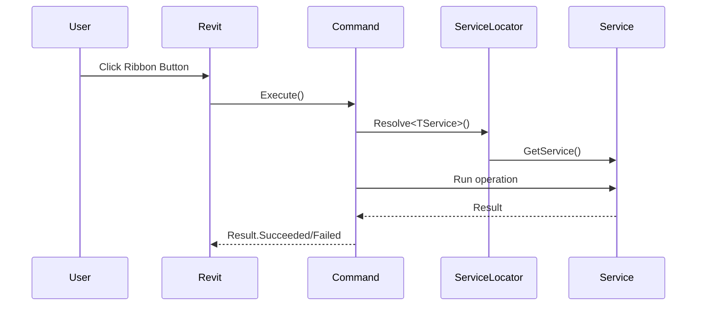

# Command Execution Flow

```mermaid
sequenceDiagram
    participant User
    participant Revit
    participant Command
    participant ServiceLocator
    participant Service

    User->>Revit: Click Ribbon Button
    Revit->>Command: Execute()
    Command->>ServiceLocator: Resolve<TService>()
    ServiceLocator->>Service: GetService()
    Command->>Service: Run operation
    Service-->>Command: Result
    Command-->>Revit: Result.Succeeded/Failed
```
