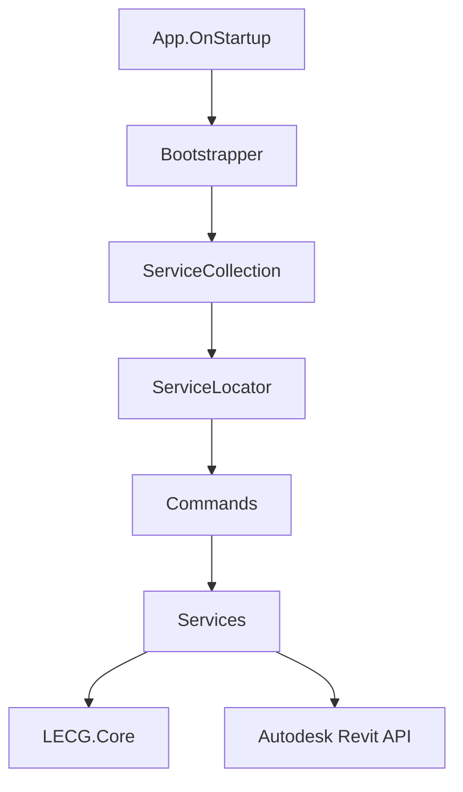

# Component Dependency Diagram

```mermaid
graph TD
    App[App.OnStartup] --> Bootstrapper
    Bootstrapper --> DI[ServiceCollection]
    DI --> ServiceLocator
    ServiceLocator --> Commands
    Commands --> Services
    Services --> Core[LECG.Core]
    Services --> RevitAPI[Autodesk Revit API]
```
