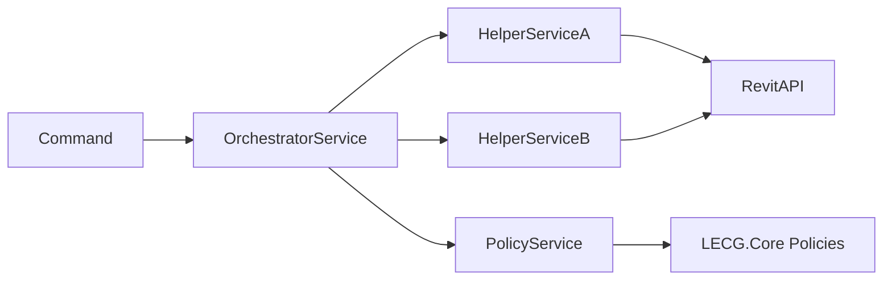

# Service Interaction Diagram

```mermaid
graph LR
    Command --> OrchestratorService
    OrchestratorService --> HelperServiceA
    OrchestratorService --> HelperServiceB
    OrchestratorService --> PolicyService
    HelperServiceA --> RevitAPI
    HelperServiceB --> RevitAPI
    PolicyService --> CoreLogic[LECG.Core Policies]
```
