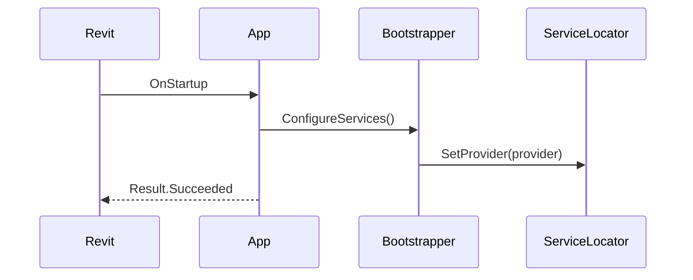

# Application Startup Sequence

```mermaid
sequenceDiagram
    participant Revit
    participant App
    participant Bootstrapper
    participant ServiceLocator

    Revit->>App: OnStartup
    App->>Bootstrapper: ConfigureServices()
    Bootstrapper->>ServiceLocator: SetProvider(provider)
    App-->>Revit: Result.Succeeded
```
